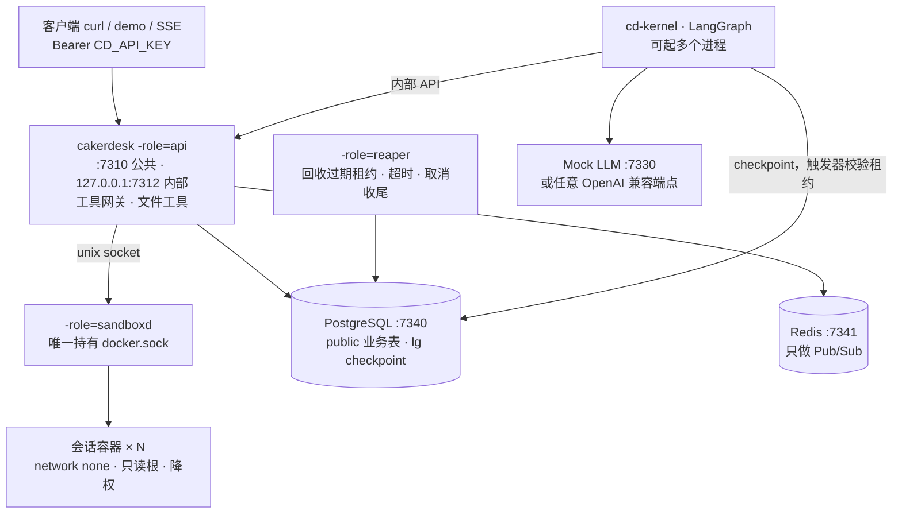

# Cakerdesk V1.1

面向长任务的可靠 Agent Runtime。从空仓库开始的分阶段实现规格。

- 版本：V1.1
- 日期：2026-09-29
- 本文取代 `docs/report/cakerdesk-v1.html`。HTML 版里的完整 SQL 和代码骨架不再是实现依据。
- 三条主线：崩溃恢复、工具执行语义、Skill 与工具权限的硬约束。
- 组成：Go 1.25+（Gin，api / reaper / sandboxd）、Python LangGraph 内核、PostgreSQL 16、Redis（只做 Pub/Sub）、Docker。
- 节奏：6 个阶段、19 个步骤。每一步是一个开发检查点：能跑、能测、能演示，然后提交。

凡本文给出表结构、列名、状态值、不变量、接口字段、错误码、事件类型、测试名或验收标准的地方，实现必须与之一致。要偏离，先改本文。

本文给出目标和约束，不给出可粘贴的实现。SQL 怎么写、函数怎么拆，由你自己完成。

---

## 1. 这份规格怎么用

### 1.1 为什么从头来

旧 P0 的主体是多租户控制平面：租户、成员、角色、RLS、密钥、审计、配额。V1 的核心是 runtime。那一层会给之后每张表、每条查询加上租户和权限方面的负担，也会把面试的第一印象带偏。

V1 从空仓库开始。旧 P0 不迁移代码，只沿用几样做法：goose 管迁移、archtest、完成时的 stub 检查、破坏测试、Mock LLM 的场景思路、Agent 版本不可变。

### 1.2 开发原则

1. HTTP 用 Gin。公共 API 与内部 API 各一个 `gin.Engine`。SSE 保留，整体通信设计不变。
2. 数据访问是 pgx + sqlc。能静态写死的 SQL，包括 runtime 核心 SQL，放进 sqlc 的查询文件，由你手写 SQL，sqlc 只生成带类型的调用代码。
3. 必须动态拼接的 SQL 才直接写 pgx。V1 里明确的一处是事件的批量插入。checkpoint fencing 是迁移里的触发器函数，加上内核设置的会话参数，不走 sqlc。
4. 核心 SQL 集中在 `queries/runtime.sql`：领取、心跳、reaper、fencing 条件更新、工具执行的状态转换。普通 CRUD 放 `queries/app.sql`。
5. 19 个步骤按顺序做，后一步依赖前一步的测试。一步完成就提交。不要求为每一步打 tag，也不要求一步一提交。
6. 开发过程中允许 `TODO` 记录尚未实现的点。一个步骤宣告完成时，`go/`、`kernel/`、`mockllm/` 里不得残留 `TODO`、`FIXME`、`XXX`、`NotImplemented`、`panic("unimplemented")`，也不得残留“返回空值假装完成”的代码。
7. 每写完一条可靠性测试，手动拿掉被测的那条保证，确认测试失败，再还原。不为此维护基础设施。F1 再把 S1–S8 收成补丁和 runner。
8. `make test` 只跑单元测试和直接连数据库的集成测试，不启动业务进程。`make e2e` 才启动 api、reaper、sandboxd、kernel、mock-llm，只覆盖关键故障场景。
9. sandboxd 只提供三个能力：确保会话容器、执行命令、删除容器。杀掉进程组绑定在执行请求的生命周期上，不单设接口。
10. 不加本文之外的功能。想加的写进 `docs/later.md`。

### 1.3 一步里有什么

| 栏目 | 含义 |
|---|---|
| 目标 | 这一步结束时系统多了什么能力 |
| 学习 | 先读懂再写。资料见附录 D |
| 约束 | 必须满足的行为、数据不变量、接口。不含实现 |
| 测试 | 测试名固定。写明断言什么 |
| 完成标准 | 全部满足才算这一步完成 |
| 本步不做 | 明确推迟到哪一步 |
| 坑 | 现象和原因。解法自己找 |

### 1.4 规范性边界

下面这些写死，步骤之间靠它们对接：

- 表名、列名、状态取值、CHECK 与唯一性不变量、索引的用途。
- 接口路径、请求和响应字段、错误码、事件类型、自定义 SQLSTATE。
- 测试名。
- 时限、字节上限、重试次数这些数字。

下面这些由你决定，规格不规定：

- 函数、文件和包的拆分（第 5.1 节只给建议布局）。
- SQL 的具体写法，只要满足约束。
- Gin 中间件怎么组织、sqlc 的生成代码放在哪。

---

## 2. 定位与范围

### 2.1 定位

Cakerdesk 把一次 LLM Agent 的执行放进数据库驱动的租约里。worker 被 `kill -9`、进程被暂停后恢复、工具执行到一半中断、模型调用未授权的工具时，Run 仍然能续跑，已完成的副作用不重复，越权调用被拒绝，全过程能从事件和数据库里复盘。

### 2.2 三条主线

| 主线 | 要证明的事 | 步骤 |
|---|---|---|
| 崩溃恢复 | 任何进程随时被杀，Run 会被别的 worker 接手，从最近的 checkpoint 续跑。已被接管的旧 worker 的任何写入都被拒绝，包括它对 checkpoint 的写入。 | B2、C1–C4 |
| 工具执行语义 | 每次调用在执行前先持久化 `started`。恢复时，已完成的调用重放结果；幂等工具重跑；非幂等工具报告 `interrupted`，由模型决定下一步。不宣称 exactly-once。 | D1、D2、D4 |
| 权限硬约束 | 模型能调用的工具等于 Agent 配置的工具与（基线工具 ∪ 已加载 Skill 的 allowed-tools）的交集。检查发生在 Go 网关。bash 在无网络、只读根文件系统、降权的容器里运行。 | D3、E1 |

### 2.3 V1 包含

- Agent 与不可变的 AgentVersion。Session 拥有工作区与容器。Run 绑定一个版本并快照配置。
- PostgreSQL 作为队列：`FOR UPDATE SKIP LOCKED` 领取，租约，心跳，`attempt` 作为 fencing token，reaper 回收。
- LangGraph 内核，`thread_id = run_id`。checkpoint 写入在同一事务里校验租约。
- 取消与超时是状态转换。
- 事件持久化，按 Run 单调递增 `seq`，Redis Pub/Sub 推送，SSE 支持 `Last-Event-ID`。
- 工具网关，6 个工具，幂等键 `(run_id, tool_call_id)`。
- 每个 Session 一个 Docker 容器。bash 超时或调用方断开时杀掉整个进程组。
- Skill：`SKILL.md` 声明 allowed-tools，`load_skill` 激活，只读挂载。
- 最小上下文：LLM 重试、预算、循环保护、压缩。
- Mock LLM 覆盖全部测试和演示。配置改成任意 OpenAI 兼容端点即可换真模型。

### 2.4 V1 不包含

| 不做 | 面试时怎么说 |
|---|---|
| 多租户、RBAC、RLS | 单用户 runtime。扩展路径是每表加 `tenant_id` 加 RLS，内部操作走 BYPASSRLS 角色。 |
| 跨会话记忆、向量检索 | 长任务靠上下文压缩和工作区文件承载状态。 |
| Goal 续跑、定时任务、审批、子 Agent | 都是等待-恢复。V1 的状态机留出了形状，不实现。 |
| Redis Streams、outbox、Kafka | 领取放在 PostgreSQL，只有一个事实来源。Redis 丢失只影响实时推送。 |
| 控制台 | 用 curl、SSE 和 SQL 演示。 |
| token 级流式输出 | 事件粒度是一条消息或一次工具调用。 |
| 密钥管理、审计表 | LLM Key 走环境变量。事件表就是轨迹。 |
| Kubernetes、多副本 api | 单机。api 无共享状态，除了进程内的在飞调用表。 |

### 2.5 信任边界

单用户系统。Skill 由用户自己放进 `skills/`，视为可信代码。模型的行为不可信。沙箱防御模型发出的命令：删除文件、联网外传、fork 炸弹、越出工作区。它不防御恶意的 Skill 作者。

---

## 3. 总体架构



### 3.1 进程

| 进程 | 通道 | 职责 | 数据库角色 |
|---|---|---|---|
| `-role=api` | `:7310` 公共；`127.0.0.1:7312` 内部 | 公共 REST 与 SSE；内部 API；工具网关与文件工具；通过 unix socket 调 sandboxd | `cd_app` |
| `-role=reaper` | 无 | 回收过期租约，处理超时，以及“已请求取消但 worker 已死”的 Run | `cd_app` |
| `-role=sandboxd` | `var/run/sandboxd.sock`，权限 `0600` | 唯一接触 Docker 的进程。确保容器、执行命令、删除容器。没有数据库连接 | 无 |
| `cd-kernel` | 出站到 7312 和 LLM | 领取、跑图、心跳、批量上报事件、调工具网关、写 checkpoint、完成 Run。一个进程同时只跑一个 Run | `cd_kernel`，只能访问 `lg` |
| mock-llm | `:7330` | OpenAI 兼容的 `/v1/chat/completions` | 无 |

### 3.2 写入边界

1. PostgreSQL 是唯一事实来源。Redis 丢消息只影响实时推送。SSE 重连后从数据库补齐。
2. `public` 表只有 Go 写。内核改变业务状态一律走内部 API，由 Go 校验租约后落库。
3. 内核唯一直接写的是 `lg` 里的 checkpoint。每次写入由触发器在同一事务里校验租约。
4. 带租约的写入都是条件更新：`id`、`attempt`、`lease_owner`、`status = 'running'` 四个条件同时成立才生效。影响 0 行则返回 `409 lease_lost`。
5. 时间只用数据库的 `now()`。过期由 reaper 裁决。进程不用本地时钟判断租约是否过期。内核只用单调时钟做保守的自我停止。

### 3.3 一次 Run 的路径

1. `POST /v1/sessions/{sid}/runs`：没有活跃 Run 才插入，状态 `queued`，事件 `run.queued`。
2. 内核 `POST /internal/runs/claim`：`SKIP LOCKED` 领取，`attempt` 加 1，租约 30 秒，事件 `run.started`。
3. 内核按 `thread_id = run_id` 读 checkpoint。有则发 `run.resumed` 并继续；没有则从 system 加 user 消息开始。
4. 循环：agent 节点调 LLM，tools 节点逐个调用工具网关。每个节点结束写 checkpoint。每 10 秒心跳，续租 30 秒，响应里带是否已请求取消。事件每 500 毫秒或满 20 条批量上报。
5. `submit_result` 成功后 `complete`，状态 `succeeded`。
6. reaper：租约过期且 `attempt < max_attempts` 则回到 `queued`，否则 `failed`。

---

## 4. 技术选型

| 部分 | 选择 | 理由 |
|---|---|---|
| HTTP | Go 1.25+，Gin | 少在路由、绑定和中间件上花时间。需要 `os.Root` 的 `MkdirAll` 和 `Rename`（1.25）。 |
| 数据库 | pgx v5 + sqlc | 静态 SQL 得到类型检查。核心 SQL 集中在一个文件里，仍然是手写的。 |
| 迁移 | goose v3，SQL 文件 `//go:embed` | 迁移以 `cd_migrate` 身份执行。 |
| Redis | go-redis v9 | 只用 `PUBLISH` 和 `SUBSCRIBE`。 |
| Docker | Docker Engine Go SDK，仅 sandboxd 引用 | archtest 强制。 |
| 日志与配置 | `log/slog` JSON；环境变量见附录 B | |
| Python | 3.12，uv | |
| 内核 | LangGraph、`langgraph-checkpoint-postgres`、psycopg 3、`langchain-openai`、httpx | `ChatOpenAI(base_url=...)` 对接 mock 或真端点。 |
| Mock | FastAPI + uvicorn + PyYAML | |
| 测试 | Go `testing`；pytest。集成测试直接连 PostgreSQL，每个测试一个临时库 | |
| 基础设施 | compose：`postgres:16`、`redis:7`、mock-llm | Go 与 Python 进程在宿主机跑，方便 `kill -9`，工作区路径与容器挂载一致。 |

A1 完成后把实际版本写进 `go.mod`、`uv.lock` 和 README。`langgraph-checkpoint-postgres` 在 A1 之后不要升级：C3 的触发器依赖它的三张表都有 `thread_id` 列，表的其他结构会随版本变。

### 4.1 sqlc 的边界

走 sqlc 的查询也是手写 SQL。sqlc 生成调用代码，不生成 SQL。

| 位置 | 内容 |
|---|---|
| `queries/app.sql` | Agent、Session、Run 的创建与查询，文件类查询之外的普通读写 |
| `queries/runtime.sql` | 领取、心跳、完成、取消、reaper、租约校验、工具执行的插入与状态转换 |
| 手写 pgx | 事件批量插入：条数不固定，用一次 `unnest` 写入。以及测试里临时拼的 SQL |
| 迁移 SQL | 表、索引、触发器函数。goose 执行，sqlc 只把迁移当作 schema 来源 |

`queries/runtime.sql` 里每条语句用 sqlc 的命名约定标出名称，名称与测试和面试讲解对应，例如 `ClaimRun`、`Heartbeat`、`ReapExpired`。

---

## 5. 全局约定

### 5.1 建议的仓库布局

可以调整，只要 archtest 的边界还在。

```text
go/
  cmd/cakerdesk/main.go          子命令 migrate；-role=api|reaper|sandboxd
  migrations/                    goose SQL，embed
  queries/app.sql  runtime.sql
  internal/...                   config apperr httpx agents sessions runs events
                                 gateway tools skills sandboxd sandboxclient kernelapi archtest
kernel/                          uv 项目 cd-kernel
mockllm/
sandbox/Dockerfile
skills/csv-report/
deploy/compose.yaml  postgres-init/00-roles.sql
tests/e2e/  tests/sabotage/      sabotage 在 F1 才建立
demo/
var/                             运行时目录，gitignore
docs/later.md  docs/interview.md
Makefile  README.md
```

archtest 两条规则：

- 除 `internal/sandboxd` 外，任何包不得依赖 Docker SDK（`github.com/docker/`、`github.com/moby/`）。
- 除 `internal/kernelapi` 与 `cmd/cakerdesk` 外，任何包不得注册内部 API 的路由。

### 5.2 ID、时间、枚举

- 实体 ID 用 UUID，`gen_random_uuid()`。不引入 pgcrypto。
- `worker_id` 由内核进程启动时生成，格式 `<主机名>-<pid>-<8位随机>`。重启即换。
- `executor_id` 由 api 进程启动时生成，格式相同。
- 时间列都是 `timestamptz`。租约计算用 `now()`。
- 状态用 `text` 加 `CHECK`。不用 PostgreSQL 枚举类型。

### 5.3 错误响应

```json
{"error": {"code": "lease_lost", "message": "..."}}
```

业务错误带 `code`、HTTP 状态和 message。未分类错误一律 `500 internal`，并写日志。错误码见附录 A。

### 5.4 测试

- `CD_TEST_DATABASE_URL` 指向 compose 里的 PostgreSQL。每个测试创建独立数据库 `cd_test_<随机>`，跑完全部迁移，结束时删除。
- 测试名是契约。改名要同步改第 16 章。
- 等状态用“轮询直到成立或超时”，超时上限 10 秒。不用固定 `Sleep` 当作断言。
- 测试里可以缩短时限：`CD_LEASE_SECONDS=3`、`CD_HEARTBEAT_SECONDS=1`、`CD_REAPER_INTERVAL_MS=300`。
- 需要 Docker 的测试带 build tag `docker`，只在 `make e2e` 里跑。

### 5.5 工具注册表随步骤增长

| 步骤 | 注册表里有的工具 |
|---|---|
| A2 | 只有 `submit_result` 的规格（名字、描述、参数 schema、是否幂等）。执行在 B3 |
| B3 | `submit_result` 可执行 |
| D1 | 加上 `list_files`、`read_file`、`write_file` |
| D4 | 加上 `bash` |
| E1 | 加上 `load_skill` |

测试里可以注册只存在于 `_test.go` 的替身工具。生产注册表里没有它们。

---

## 6. 阶段总览

| 步 | 名称 | 新增能力 | 完成时能看到 |
|---|---|---|---|
| A1 | 仓库与基础设施 | Gin、compose、`make test`、archtest | `/healthz` 返回 ok |
| A2 | 数据库与 Agent 版本 | 三角色、迁移、sqlc、API Key、版本不可变 | 改历史版本被数据库拒绝 |
| A3 | Mock LLM | 无状态场景、唯一 tool_call_id、按次数注入错误 | curl 一个场景得到逐步的工具调用 |
| B1 | Session 与 Run 入队 | 一个会话最多一个活跃 Run | 第二个 Run 返回 `409 session_busy` |
| B2 | Claim | 内部 API、`SKIP LOCKED`、长轮询、完成 | 两个并发领取拿到不同的 Run |
| B3 | LangGraph 内核 | 跑图、`submit_result`、checkpoint | Run 从 queued 到 succeeded |
| B4 | 事件与 SSE | seq、Pub/Sub、`Last-Event-ID` | 断线重连不丢不重 |
| C1 | 租约与心跳 | 续租、条件写、409 后自我停止 | 改掉 attempt，旧 worker 停止 |
| C2 | Reaper 与续跑 | 过期回收、从 checkpoint 继续 | `kill -9` 内核后另一个内核接上 |
| C3 | Checkpoint fencing | 触发器、`FOR SHARE`、`cd_kernel` 权限收紧 | 暂停后恢复的旧内核写 checkpoint 被拒 |
| C4 | 取消与超时 | `cancel_requested_at`、deadline | 运行中取消，在节点边界停止 |
| D1 | 网关与文件工具 | `tool_executions`、重放、`os.Root` | 同一 tool_call_id 只执行一次 |
| D2 | 执行语义 | `started` 先提交、恢复规则 | 模拟 api 重启后，非幂等调用变 interrupted |
| D3 | sandboxd | 三个接口、加固容器、进程组 | 联网失败、写根目录失败、后台子进程被杀 |
| D4 | bash 与崩溃恢复 | bash、取消沿 ctx 传到容器 | bash 执行中杀内核：bash interrupted，read_file 重放 |
| E1 | Skill 与权限 | `SKILL.md`、`load_skill`、有效工具集合 | 未加载 Skill 时 bash 被拒 |
| E2 | 重试、预算、循环保护 | 计数进图状态 | 注入两次 429 后成功；死循环第 5 次失败 |
| E3 | 上下文压缩 | 摘要加保留最近消息，不拆工具对 | 出现 `context.compacted` 后仍然完成 |
| F1 | 收口 | S1–S8、演示、README | `make sabotage` 与 `demo.sh` |

依赖：

```text
A1 → A2 → A3 → B1 → B2 → B3 → B4 → C1 → C2 → C3 → C4
                                              → D1 → D2 → D3 → D4 → E1 → E2 → E3 → F1
```

顺序的原因：

- 事件放在可靠性之前。后面每一步靠时间线验证。
- 租约放在工具语义之前。恢复规则依赖 `attempt` 和 fencing。
- 执行语义放在沙箱之前，用测试替身证明。bash 接上之后做端到端验证，生产代码里不出现假工具。
- Skill 权限放在 bash 之后。权限最有说服力的对象是 bash。

---

## 7. 阶段 A：地基

结束时：一键能起基础设施，一键能跑测试，数据库有三角色和可重复的迁移，Agent 有不可变版本，假模型可预测。

### A1　仓库与本地基础设施

**目标。** `make up` 启动 PostgreSQL 与 Redis。`make test` 跑 Go 与 Python。`make lint` 含格式、archtest。`cakerdesk -role=api` 的 `GET /healthz` 返回 `{"status":"ok"}`。

**学习。** Go module 与 `internal` 可见性。Gin 的路由、中间件、优雅退出。uv。compose 的 healthcheck。

**约束。**

- 公共服务监听 `:7310`。`/healthz` 免鉴权。
- `-role` 取值 `api`、`reaper`、`sandboxd`。A1 只实现 `api`。其他取值退出码 2。
- `SIGINT`、`SIGTERM` 触发优雅退出。
- 配置从环境变量读取，缺必填项则启动失败。
- 请求体 JSON 拒绝未知字段，上限 1 MiB。
- archtest 的第一条规则（5.1）从这一步就在。
- `scripts/lint-stubs.sh` 存在，但只在宣告步骤完成时运行，不放进每次 `make test`。
- compose：`postgres:16` 映射 7340，`redis:7` 映射 7341。Redis 不持久化。两者都有 healthcheck。
- README 写一句话定位、启动方式和 19 步进度清单。清单随步骤勾选。

**测试。**

- `TestHealthz`：200 且 body 为 `{"status":"ok"}`。
- `TestArchRules`：当前模块通过；对一份构造的依赖列表能检出违规。
- `kernel` 的 `cd-kernel --version` 输出版本号。

**完成标准。** 全新克隆后 `make up && make test && make lint` 通过。README 有启动步骤和进度清单。

**本步不做。** 数据库连接、mock-llm 容器、业务路由。

**坑。** lint-stubs 扫到 `docs/` 会误伤，因为规格正文里会出现这些词。archtest 解析源码文本会漏掉间接依赖。

### A2　数据库、迁移与 Agent 版本

**目标。** 三个数据库角色、可重复执行的迁移、sqlc 能生成代码、静态 API Key 鉴权、Agent 与不可变版本。历史版本在数据库层面不可修改。

**学习。** 角色、schema、`GRANT`、`ALTER DEFAULT PRIVILEGES`。pgx 连接池与事务。sqlc 的查询注解和 schema 来源。goose。不可变版本加当前版本指针。

**约束：角色。** 由 compose 初始化，以超级用户执行一次。

| 角色 | 用途 |
|---|---|
| `cd_migrate` | 表的属主。只用于迁移和 `cd-kernel setup` |
| `cd_app` | api 与 reaper |
| `cd_kernel` | 内核。`search_path` 固定为 `lg`。A2 结束时它对 `public` 无权限 |

数据库名 `cakerdesk`，属主 `cd_migrate`。

**约束：0001。** 以 `cd_migrate` 执行。

- `REVOKE CREATE ON SCHEMA public FROM PUBLIC`。`cd_app` 有 `public` 的 `USAGE`。
- `cd_migrate` 在 `public` 之后新建的表，默认把 `SELECT、INSERT、UPDATE、DELETE` 授予 `cd_app`。
- schema `lg` 属主 `cd_migrate`。`cd_kernel` 有其 `USAGE`。`cd_migrate` 在 `lg` 之后新建的表，默认把四种权限授予 `cd_kernel`。
- 迁移命令 `cakerdesk migrate up|down|status`，连接串 `CD_MIGRATE_DATABASE_URL`。api 用 `CD_DATABASE_URL`（`cd_app`）。

**约束：`agents`。**

| 列 | 约束 |
|---|---|
| `id` | uuid，主键，默认 `gen_random_uuid()` |
| `name` | 唯一，匹配 `^[a-z0-9][a-z0-9-]{1,62}$` |
| `current_version` | int，可空 |
| `created_at`、`updated_at` | `timestamptz`，默认 `now()` |

**约束：`agent_versions`。**

| 列 | 约束 |
|---|---|
| `agent_id` | 外键 `agents.id` |
| `version` | int，≥ 1 |
| `config` | jsonb |
| `config_hash` | text，规范化配置的 sha256 |
| `created_at` | `timestamptz` |
| 主键 | `(agent_id, version)` |

`cd_app` 对 `agent_versions` 没有 `UPDATE` 和 `DELETE`。

**约束：AgentConfig。** 字段在对应步骤才开始被执行逻辑使用，A2 就要能存能校验。

```json
{
  "model": "mock-1",
  "system_prompt": "...",
  "tools": ["load_skill", "list_files", "read_file", "write_file", "bash", "submit_result"],
  "skills": ["csv-report"],
  "limits": {
    "max_llm_calls": 40,
    "max_tool_calls": 80,
    "max_total_tokens": 200000,
    "max_duration_s": 1800,
    "max_attempts": 3
  },
  "context": { "compact_threshold_tokens": 12000, "keep_last_messages": 8 }
}
```

| 规则 | 要求 |
|---|---|
| `tools` | 非空、无重复、每个名字在注册表里、必须含 `submit_result`。A2 的注册表只有 `submit_result`，所以 A2 能发布的配置只含它。其余工具随 5.5 进入注册表后才能写入配置 |
| `limits` | `max_llm_calls` 1–500；`max_tool_calls` 1–1000；`max_total_tokens` 1000–5000000；`max_duration_s` 10–86400；`max_attempts` 1–10。缺省取上面 JSON 里的值 |
| `context` | `compact_threshold_tokens` 2000–200000；`keep_last_messages` 2–50 |
| `system_prompt` | 1–20000 字符 |
| `skills` | A2 允许空数组。非空的校验在 E1。缺省空数组 |
| 未知字段 | 400 `invalid_config`，message 指出字段路径 |

规范化：缺省补齐后按结构体字段的固定顺序序列化，再算 sha256。比较哈希用规范化结果。

**约束：接口。** 全部要 Bearer `CD_API_KEY`，常量时间比较。

| 接口 | 行为 |
|---|---|
| `POST /v1/agents` `{"name"}` | 201 `{"id","name","current_version":null}`。重名 409 `agent_exists` |
| `GET /v1/agents` | 按 `created_at` 倒序，最多 200 条 |
| `GET /v1/agents/{id}` | 404 `not_found` |
| `POST /v1/agents/{id}/versions` `{"config"}` | 对 `agents` 行加锁。哈希与当前版本相同则 200 返回当前版本。否则 `version = max+1`，更新 `current_version`，201 |
| `GET /v1/agents/{id}/versions/{version}` | 返回规范化后的配置 |

`/healthz` 从这一步起包含数据库 ping，失败则 503。

**测试。**

- `TestAgentVersionImmutable`：`cd_app` 对 `agent_versions` 的 `UPDATE` 得到 SQLSTATE `42501`。
- `TestPublishIncrementsVersion`、`TestPublishSameConfigIsIdempotent`。
- `TestPublishConcurrent`：10 个并发发布不同配置，版本号恰好 1 到 10。
- `TestConfigValidation`：每条规则至少一个反例。
- `TestAuthRequired`：无 Key 或错 Key 得到 401 `unauthorized`。
- `TestDefaultPrivileges`：`cd_migrate` 新建一张表后，`cd_app` 对它有 `SELECT`。

**完成标准。** `make migrate` 在空库上成功，再执行一次无变化。curl 能创建 Agent 并发布两个版本。psql 以 `cd_app` 修改 v1 被拒绝。

**本步不做。** Skill 校验、Agent 删除与重命名、分页。

**坑。** `ALTER DEFAULT PRIVILEGES FOR ROLE cd_migrate` 只作用于该角色之后创建的表。用超级用户跑迁移时，表属主是超级用户，默认权限不生效，`cd_app` 会没有权限。

### A3　Mock LLM

**目标。** 一个无状态的 OpenAI 兼容假模型。当前步骤从请求内容推断。支持按次数的错误注入和延迟。

**学习。** Chat Completions 的 tool calling：`tool_calls[].id`、`function.arguments` 是 JSON 字符串、`role: tool` 用 `tool_call_id` 回应。

**约束：场景文件。** `mockllm/scenarios/*.yaml`。启动时全部加载，任一不合法则进程启动失败。

```yaml
name: csv-report
steps:
  - tool_calls:
      - {name: load_skill, args: {name: csv-report}}
  - tool_calls:
      - {name: read_file, args: {path: data/sales_01.csv}}
      - {name: bash, args: {command: "python3 /skills/csv-report/scripts/aggregate.py data out/summary.csv"}}
  - repeat: 3
    tool_calls:
      - {name: list_files, args: {path: out}}
  - content: "Done."
    tool_calls:
      - {name: submit_result, args: {summary: "Aggregated 20 files", data: {rows: 20}}}
errors:
  - {step: 1, status: 429, times: 2}
delays:
  - {step: 2, ms: 1500}
```

合法条件：`repeat` ≥ 1；工具名非空；带 `content` 且没有 `tool_calls` 的步骤只能是最后一步。

**约束：协议。**

| 规则 | 要求 |
|---|---|
| 场景 | 第一条 user 消息里的 `[[scenario:NAME]]`。未知场景返回 400 |
| 步骤 | 从后往前找最后一条带 `tool_calls` 的 assistant 消息。id 匹配 `^call_(\d+)_(\d+)_[a-z0-9]{6}$` 时，下一步是其中的步骤号加 1。找不到则返回步骤 0。超过最后一步则重复最后一步 |
| id | `call_{步骤}_{序号}_{6位随机}`。同一次响应内唯一。随机后缀使测试不能依赖 id 的具体值 |
| arguments | JSON 对象的标准序列化，不是 Python 的 `str(dict)` |
| 错误注入 | 计数键是 `(请求体 user 字段, 步骤)`。未超过 `times` 时返回该 HTTP 状态。429 带 `retry-after: 0` |
| 摘要 | system 消息含 `[[cd:summarize]]` 时不推进步骤，返回 `content` 为 `SUMMARY: {n} messages condensed.`，n 是输入消息数 |
| usage | `prompt_tokens` 为全部消息字符数除以 4，`completion_tokens` 为输出字符数除以 4 |
| 调试 | `GET /mock/requests?user=` 返回最近 500 条请求摘要。`POST /mock/reset` 清空计数和日志 |

compose 增加 `mock-llm`，映射 7330。

**测试。** 都在 `mockllm/tests`，不依赖 Go 进程。

- `test_ids_unique_and_parseable`
- `test_arguments_are_json`
- `test_step_from_history`：历史只保留最后一对 assistant 与 tool 消息时，步骤仍然正确。
- `test_replay_same_request_same_step`：同一请求两次，工具名和参数相同。id 可以不同。
- `test_error_times`：前两次 429，第三次成功。换 `user` 后重新计数。
- `test_repeat_expansion`、`test_summarize_mode`、`test_invalid_scenario_rejected_at_startup`

**完成标准。** 用官方 OpenAI Python SDK、`base_url` 指向 mock，能解析每个响应。上面三个关于 id、arguments、错误次数的测试都在。

**本步不做。** 流式响应、embedding、按内容分支的场景。

**坑。** 服务端如果用内存游标记“该用户走到第几步”，内核崩溃后重发同一请求会错位。步骤必须能只从这一次请求里推出来。

---

## 8. 阶段 B：最小运行闭环

结束时：创建 Run，内核领取，LangGraph 调 mock，`submit_result`，状态变成 `succeeded`，SSE 能看全程。这一阶段不续租、不回收。租约字段存在，过期没有后果。

### B1　Session 与 Run 入队

**目标。** 创建 Session 时建立工作区目录。创建 Run 时绑定当前版本并快照配置。一个 Session 同时最多一个活跃 Run，由数据库保证。

**学习。** 部分唯一索引。`CHECK` 表达状态不变量。SQLSTATE `23505` 与约束名。

**约束：`sessions`。**

| 列 | 约束 |
|---|---|
| `id` | uuid 主键 |
| `agent_id` | 外键 `agents.id` |
| `title` | text，默认空串 |
| `created_at` | `timestamptz`，默认 `now()` |

**约束：`runs`。** 这一步建表，后续步骤只加列。

| 列 | 约束 |
|---|---|
| `id` | uuid 主键 |
| `session_id` | 外键 |
| `agent_id`、`agent_version` | 外键指向 `agent_versions` 的主键 |
| `config` | jsonb，创建时的快照 |
| `input` | text，长度 1–20000 |
| `status` | `queued`、`running`、`succeeded`、`failed`、`cancelled` 之一，默认 `queued` |
| `attempt` | int，默认 0 |
| `max_attempts` | int，取自配置 |
| `lease_owner` | text，可空 |
| `lease_expires_at` | `timestamptz`，可空 |
| `result` | jsonb，可空 |
| `error_code`、`error_message` | text，可空 |
| `created_at`、`started_at`、`finished_at`、`updated_at` | `timestamptz`。`created_at` 与 `updated_at` 默认 `now()` |

不变量：

- `status = 'running'` 当且仅当 `lease_owner` 与 `lease_expires_at` 都非空。
- `status` 为 `succeeded`、`failed`、`cancelled` 之一，当且仅当 `finished_at` 非空。
- 部分唯一索引 `runs_one_active_per_session`：同一 `session_id` 在 `status ∈ (queued, running)` 时最多一行。
- 索引 `runs_queued_fifo`：`status = 'queued'` 上的 `created_at`。
- 索引 `runs_running_lease`：`status = 'running'` 上的 `lease_expires_at`。

**约束：接口。**

| 接口 | 行为 |
|---|---|
| `POST /v1/sessions` `{"agent_id","title?"}` | Agent 没有 `current_version` 则 409 `agent_unpublished`。插入与创建目录 `var/workspaces/<id>`（`0755`）在同一事务里，目录失败则回滚 |
| `GET /v1/sessions/{id}` | 含 `active_run_id`，没有则为 null |
| `POST /v1/sessions/{id}/runs` `{"input"}` | 快照当前版本的配置。违反唯一索引则 409 `session_busy`，message 带当前活跃 run 的 id |
| `GET /v1/runs/{id}` | 字段：`id`、`session_id`、`agent_version`、`status`、`attempt`、`result`、`error`（`code` 与 `message`）、三个时间。不含 `config` |
| `GET /v1/runs/{id}/config` | 返回快照 |
| `GET /v1/sessions/{id}/runs` | 该会话的 Run，按 `created_at` 倒序，最多 200 条 |

**测试。**

- `TestCreateRunQueued`：状态 `queued`，`attempt` 为 0，`config` 等于当时的当前版本。
- `TestOneActiveRunPerSession`：20 个并发创建，恰好 1 个 201，其余 409。
- `TestRunSnapshotsConfig`：创建 Run 后再发布新版本，该 Run 的 `config` 和 `agent_version` 不变。
- `TestRunStatusInvariants`：插入 `status='running'` 且 `lease_owner` 为空，被 CHECK 拒绝。

**完成标准。** curl 演示第二个 Run 得到 `session_busy`。工作区目录存在。

**本步不做。** 取消、文件上传、删除 Session。

**坑。** 先查有没有活跃 Run 再插入，挡不住两个同时通过检查的请求。唯一性只能由约束保证，代码负责把 `23505` 翻译成 409。

### B2　Claim

**目标。** 内部 API 上线。worker 长轮询领取。并发领取互不冲突。完成 Run 带 fencing 条件。

**学习。** `SELECT … FOR UPDATE SKIP LOCKED`。用一条语句完成“选中并更新”。长轮询与短事务。fencing token：`attempt` 每次领取加 1。

**约束：内部 API。**

- 只监听 `127.0.0.1:7312`。Bearer `CD_INTERNAL_TOKEN`。
- 带租约的请求都包含 `worker_id` 和 `attempt`。

**约束：领取。**

- 一条 SQL 完成选择和更新。条件 `status = 'queued'`，按 `created_at` 升序，`FOR UPDATE SKIP LOCKED`，`LIMIT 1`。
- 更新：`status = 'running'`，`attempt` 加 1，`lease_owner` 为请求里的 worker，`lease_expires_at = now() + 租约`，`started_at` 只在为空时写入，`updated_at = now()`。
- 返回 `id`、`session_id`、`attempt`、`config`、`input`。
- 每次尝试是一个独立的短事务。

**约束：接口。**

| 接口 | 行为 |
|---|---|
| `POST /internal/runs/claim` `{"worker_id","wait_ms"}` | `wait_ms` 上限取 `CD_CLAIM_MAX_WAIT_MS`（20000）。拿到则 200；到时没有则 204。等待期间每 500 毫秒重试一次。200 的字段：`run_id`、`session_id`、`attempt`、`input`、`config`、`tools`、`lease_seconds`、`heartbeat_seconds`。`tools` 按 `config.tools` 从 Go 注册表取出，元素含 `name`、`description`、`parameters` |
| `POST /internal/runs/{id}/complete` `{"worker_id","attempt","status","result?","error?":{"code","message"}}` | 这一步 `status` 只能是 `succeeded` 或 `failed`。条件更新四个 fencing 条件，写入 `result` 或 `error_code` 加 `error_message`，`finished_at = now()`，清空 `lease_owner` 和 `lease_expires_at`。0 行则 409 `lease_lost` |

**测试。**

- `TestClaimSkipLocked`：5 个 queued，10 个并发 claim（`wait_ms=0`），恰好 5 个成功且 run_id 不同。
- `TestClaimFIFO`。
- `TestClaimLongPollWakes`：先发起 `wait_ms=5000` 的 claim，1 秒后插入 Run，2 秒内返回它。
- `TestClaimEmptyReturns204`。
- `TestCompleteRequiresFence`：错误的 attempt、错误的 worker、已经终态，都是 409。
- `TestInternalAPIRequiresToken`。

**完成标准。** 两个并发 curl 拿到不同的 Run。错误 attempt 完成得到 409。

**本步不做。** 心跳与回收。Run 被领走后如果一直不 complete，会停在 `running`。这是留给 C2 的缺口。用 `LISTEN/NOTIFY` 代替 500 毫秒重试，记入 `docs/later.md`。

**坑。** 用一个长事务包住整个等待，会占住连接和快照。连接池上限至少是预期内核数加 10。

### B3　LangGraph 内核跑通

**目标。** 内核领取 Run，跑 agent 与 tools 的循环，调 mock，经网关执行 `submit_result`，写 checkpoint，完成 Run。

**学习。** `StateGraph`、`add_messages`、条件边、`thread_id`、checkpoint 的粒度（每个节点结束写一次；节点执行中崩溃，恢复时整个节点重跑）。`AsyncPostgresSaver` 要求连接 `autocommit=True`、`row_factory=dict_row`。`ainvoke(None, config)` 表示从已有 checkpoint 继续。

**约束：checkpoint 表。** `cd-kernel setup` 用 `CD_KERNEL_SETUP_DATABASE_URL`（`cd_migrate`，`search_path=lg`）调用 LangGraph 的 `setup()`。表属主是 `cd_migrate`，默认权限授予 `cd_kernel`。`make migrate` 等于 Go 迁移加上这一步。

**约束：图。**

- 状态至少有：`messages`（追加语义）、`result`、`nudges`。E2 会加字段。
- 节点：`agent` 调 LLM 并返回一条 assistant 消息；`tools` 按顺序逐个调用网关；`nudge` 追加一条提醒“完成后必须调用 `submit_result`”。
- 路由：有工具调用则去 `tools`；没有且 `nudges < 2` 则去 `nudge`；两次提醒后仍没有工具调用则 Run 失败，`error_code = no_result`。`tools` 之后若 `result` 已写入则结束，否则回 `agent`。
- `recursion_limit` 设为 400。

**约束：内核循环。**

- LLM：`base_url = CD_LLM_BASE_URL`，`max_retries=0`，超时 60 秒，`user` 字段填 `run_id`。重试留给 E2。
- 第一次执行的输入是 system 消息加 user 消息（`runs.input`），`result` 空，`nudges` 为 0。已有 checkpoint 时输入为“继续”。
- 工具请求：`POST /internal/runs/{id}/tool-calls`，字段 `worker_id`、`attempt`、`tool_call_id`、`name`、`args`。响应 `status` 为 `succeeded` 或 `failed`，加 `output`，失败时加 `error_code`。内核把它包成对应的 tool 消息。一条消息里的多个调用按顺序执行。
- 网关这一步：校验租约（四个条件，并对 `runs` 行 `FOR SHARE`）、工具在 `config.tools` 中且已注册、参数符合 schema，然后执行。持久化在 D1。
- `submit_result` 参数：`summary` 字符串 1–4000，`data` 可选对象。成功输出固定为 `result accepted`，并把参数写入图状态的 `result`。
- 成功则 `complete(succeeded, result)`。`RunFailed` 则 `complete(failed, error)`。
- 一个进程同时只跑一个 Run。跑完继续领取。

**测试。**

- `make test` 内：`TestToolCallRejectsUnknownTool`、`TestToolCallRequiresFence`。网关测试不启动内核进程。
- `make e2e`：`test_b3_happy_path`，场景 `hello` 一步就 `submit_result`，Run `succeeded` 且 result 等于参数。
- `test_no_result_fails`：场景只有纯文本，两次提醒后 `failed`，`error_code=no_result`，mock 恰好 3 次请求。
- `test_checkpoint_written`：`lg.checkpoints` 存在 `thread_id = run_id` 的行。
- `test_invalid_tool_args`：非法参数返回失败的 tool 消息，下一步正确调用后 Run 成功。

**完成标准。** 起 api 和内核，curl 创建 Run，几秒内查询到 `succeeded` 和 result。内核继续领取下一个。

**本步不做。** 心跳。测试场景都在几秒内结束。除 `submit_result` 外的工具。

**坑。** 在条件边函数里抛出的异常，到 `ainvoke` 的调用方时可能被包了一层。捕获时要看异常链，或者改成路由到一个专门失败的节点。

### B4　事件与 SSE

**目标。** 每个关键动作成为一行事件。`seq` 在单个 Run 内严格递增、无空洞。SSE 先订阅再回放。`Last-Event-ID` 续传不丢不重。

**学习。** 在行锁下分配序号。订阅与回放之间的竞态。SSE 的 `id`、`event`、`data`。Redis Pub/Sub 不保留离线消息。

**约束：0003。**

- `runs.last_seq bigint NOT NULL DEFAULT 0`。
- `run_events`：`run_id` 外键并 `ON DELETE CASCADE`，`seq bigint`，`type text`，`attempt int`，`payload jsonb` 默认 `{}`，`created_at`。主键 `(run_id, seq)`。

**约束：追加。**

- 分配序号与插入事件在调用方的同一个事务里。
- 带 fence 时，更新 `runs.last_seq` 的语句带四个 fencing 条件。0 行则 `lease_lost`，且 `last_seq` 不变。
- 不带 fence 的是 api 或 reaper 自己产生的系统事件，只按 `id` 更新。
- 一次追加 n 条，序号为 `last_seq-n+1` 到 `last_seq`，一条语句插入。
- 事务提交之后再 `PUBLISH run:<run_id>`。发布失败只记日志。
- 内核接口 `POST /internal/runs/{id}/events`：`worker_id`、`attempt`、`events`（最多 100 条，每条 payload 最多 64 KiB）。`type` 必须属于内核可发的白名单。响应 `{first_seq, last_seq}`。
- 内核每 500 毫秒或满 20 条刷一次，`complete` 前强制刷出。崩溃时缓冲区里还没送出的事件可以丢失。执行状态在 checkpoint 里。

**约束：事件类型。** `attempt` 列记产生时的 attempt。系统事件用当时的 `runs.attempt`。

| type | 产生方 | payload | 步骤 |
|---|---|---|---|
| `run.queued` | api | `{agent_version}` | B4 |
| `run.started` | api，与领取同一事务 | `{attempt, worker_id}` | B4 |
| `run.resumed` | kernel | `{attempt, checkpoint_id, messages}` | C2 |
| `message.assistant` | kernel | `{content, tool_calls:[{id,name,args}], usage}` | B4 |
| `tool.started` | api，网关事务内 | `{tool_call_id, name, args}` | B4 起，D1 起与持久化同事务 |
| `tool.finished` | api | `{tool_call_id, status, replayed, exec_count, duration_ms, output_preview}` | 同上 |
| `skill.loaded` | api | `{name, hash, allowed_tools}` | E1 |
| `llm.retry` | kernel | `{status, attempt_no, backoff_ms}` | E2 |
| `guard.warning` | kernel | `{kind, detail}`，kind 为 `loop` 或 `budget` | E2 |
| `context.compacted` | kernel | `{removed, kept, summary_chars}` | E3 |
| `run.lease_expired` | reaper | `{attempt, worker_id, next}`，next 为 `queued` 或 `failed` | C2 |
| `run.cancel_requested` | api | `{}` | C4 |
| `run.succeeded` | api | `{result}` | B4 |
| `run.failed` | api 或 reaper | `{code, message}` | B4 |
| `run.cancelled` | api 或 reaper | `{}` | C4 |

内核可发：`run.resumed`、`message.assistant`、`llm.retry`、`guard.warning`、`context.compacted`。

**约束：读取。**

| 接口 | 行为 |
|---|---|
| `GET /v1/runs/{id}/events?after_seq=0&limit=500` | 按 `seq` 升序 |
| `GET /v1/runs/{id}/events/stream` | SSE |

SSE 的顺序固定：

1. 订阅 `run:<id>`，等到订阅确认。
2. `last` 取 `Last-Event-ID`，否则取 `after_seq`，否则 0。
3. 回放 `seq > last` 的事件。
4. 已经写出终态事件则结束。终态是 `run.succeeded`、`run.failed`、`run.cancelled`。
5. 实时消息：`seq <= last` 丢弃；`seq > last+1` 则回到数据库补齐中间的缺口；否则写出。每 15 秒写一行 SSE 注释作为心跳。Redis 订阅出错则每 1 秒查一次数据库，直到恢复或客户端断开。
6. 每条格式为 `id`、`event`、`data` 三行加空行，写完立刻 flush。

**测试。** 除最后一条外都在 `make test`，用真实 PostgreSQL，Redis 可用测试容器或 compose。

- `TestSeqMonotonicConcurrent`：50 个并发各追加 1 条，序号恰好 1 到 50。
- `TestAppendFencedRejectsStaleAttempt`：attempt 不匹配则 `lease_lost`，`last_seq` 不变。
- `TestSSEReplayThenLive`：先写 3 条再连接，再写 2 条，客户端按序收到 1 到 5。
- `TestSSELastEventID`：`Last-Event-ID: 3` 只收到 4 起。
- `TestSSEGapFill`：库里有 seq 4，只发布了 seq 5，客户端仍收到 4 和 5。
- `TestSSEClosesOnTerminal`。
- `TestSSEWorksWithoutRedis`：Redis 地址指向关闭的端口，事件靠查库到达。
- e2e：`test_b3_happy_path` 的事件序列恰好是 `run.queued`、`run.started`、`message.assistant`、`tool.started`、`tool.finished`、`run.succeeded`。

**完成标准。** `curl -N` 能看完一个 Run，并在终态后断开。中途断开再带 `Last-Event-ID` 重连，不丢不重。

**本步不做。** token 级流式、事件保留期清理、跨 Run 的事件流。

**坑。** 先回放再订阅，会丢掉回放结束到订阅生效之间的事件。`run.started` 与领取不在同一事务，会出现“状态已是 running 但没有 started 事件”。

---

## 9. 阶段 C：运行可靠性

结束时：内核被 `kill -9` 后，另一个内核从 checkpoint 续跑。被暂停后恢复的旧内核，其心跳、事件、工具、完成和 checkpoint 写入全部被拒绝。取消和超时生效。

从 C1 起，每写完一条可靠性测试，手动破坏一次对应的保证并确认测试失败，然后还原。破坏点记在该测试旁边的注释里，供 F1 做成补丁。

### C1　租约、心跳与 fencing

**目标。** 内核每 10 秒续租。任何带租约的请求返回 `409 lease_lost` 时，内核停止该 Run 的一切动作，并且不调用 `complete`。api 长时间不可达时，内核自我停止。

**学习。** 租约是有期限的锁。`kill -9` 不会执行清理代码。Martin Kleppmann 关于 fencing token 的论证：暂停后醒来的进程会以为自己还持有锁，只能由存储端拒绝旧 token。

**约束。**

- `POST /internal/runs/{id}/heartbeat`，体 `{"worker_id","attempt"}`。条件更新四个 fencing 条件，把 `lease_expires_at` 设为 `now() + 租约`。0 行则 409，且该行的 `lease_expires_at` 不变。200 返回 `lease_expires_at`。C4 再加 `cancel_requested`。
- 提供一个可在事务内调用的租约校验：四个条件都成立才返回，并对该行 `FOR SHARE`。工具网关用它。
- 每个 Run 一个心跳任务，间隔 `heartbeat_seconds`。收到 409 则取消该 Run 的主任务。网络错误和 5xx 留到下一轮。
- 自我停止：距上次成功心跳的单调时间已达到 `lease_seconds`，视同 `lease_lost`。
- 内核把所有接口的 409 `lease_lost` 当成同一个异常。捕获后记日志、关闭数据库连接、不调用 `complete`、回到领取循环。
- 至此 fencing 覆盖心跳、事件、工具调用、完成。checkpoint 在 C3。

**测试。**

- `TestHeartbeatExtendsLease`：两次心跳之间 `lease_expires_at` 严格变大。
- `TestHeartbeatStaleAttempt409`：用 `attempt-1` 心跳得到 409，原行的过期时间不变。
- `TestHeartbeatWrongWorker409`。
- e2e `test_lease_lost_stops_kernel`：场景第 1 步延迟 8 秒。内核进入延迟后，用 SQL 把 `attempt` 加 1 并把 `lease_owner` 改成别的值。在一个心跳间隔加 1 秒之内，内核日志出现 `lease_lost`，之后 mock 请求数不再增长，Run 没有被 complete。
- e2e `test_self_fence_when_api_unreachable`：`CD_LEASE_SECONDS=3`，对 api 发 `SIGSTOP`。内核在 3 到 5 秒内放弃该 Run。

**完成标准。** 上面的测试通过。`TestHeartbeatStaleAttempt409` 已手动破坏一次：去掉心跳条件里的 `attempt` 相等，测试失败，然后还原。这是 S1 的素材。

**本步不做。** 回收过期租约。

**坑。** 取消主任务只在下一个挂起点生效。心跳任务如果在 Run 结束后还在跑，会把已经结束的 Run 继续续租。

### C2　Reaper 与崩溃续跑

**目标。** reaper 把过期 Run 重新排队；`attempt` 已达 `max_attempts` 时置为 `failed`。新内核从 checkpoint 续跑，已经完成的节点不重复调用模型。

**学习。** 回收与执行分离。多个 reaper 同时跑也安全，因为同样用 `SKIP LOCKED`。恢复时，崩溃当时正在执行的节点会重跑。

**约束：reaper。** 每 `CD_REAPER_INTERVAL_MS`（5000）一个事务。

- 选出 `status = 'running' AND lease_expires_at < now()` 的行，按过期时间排序，`FOR UPDATE SKIP LOCKED`，最多 100 行。
- `attempt >= max_attempts` 的行：`failed`，`error_code = max_attempts_exceeded`，`error_message` 含 attempt，`finished_at = now()`。其余行回到 `queued`。两种情况都清空 `lease_owner` 和 `lease_expires_at`。
- 同一事务里为每行追加 `run.lease_expired`，`next` 为 `queued` 或 `failed`。失败的再追加 `run.failed`。提交后再发布。
- 进程是 `cakerdesk -role=reaper`。

**约束：续跑。**

- 内核发现已有 checkpoint 时，先发 `run.resumed`，再 `ainvoke(None, config)`。
- checkpoint 元数据带 `cd_attempt`，值为本次 attempt。C3 用它区分写入来自哪个 attempt。

**测试。**

- `TestReaperRequeuesExpired`、`TestReaperFailsAtMaxAttempts`、`TestReaperIgnoresLiveLease`。
- `TestReaperConcurrentSafe`：两个 reaper 同时处理同一批过期 Run，每个 Run 只有一条 `run.lease_expired`。
- e2e `test_kill9_kernel_resumes`：两个内核。场景 5 步，第 3 步延迟 6 秒。A 领到且事件里出现第 2 步的 `tool.finished` 后 `kill -9` A。最终 `succeeded`，`attempt = 2`。事件含 `run.lease_expired`、`run.started`（attempt 2）、`run.resumed`。mock 日志里第 0 步和第 1 步各只有一次请求。

**完成标准。** 手动：起 api、reaper、两个内核，跑长场景，`kill -9` 正在执行的那个，SSE 里看到接管和续跑。

**本步不做。** checkpoint 写入的 fencing。此时暂停后恢复的旧内核仍可能写 checkpoint。工具只有 `submit_result`，重复执行没有副作用。

### C3　Checkpoint fencing

**目标。** 内核写 checkpoint 时，数据库在同一事务里校验租约。旧内核的写入被拒绝。

**学习。** 触发器、`SECURITY DEFINER`、`current_setting(name, true)`、自定义 SQLSTATE。`FOR SHARE` 与 `FOR UPDATE SKIP LOCKED` 的交互：持有共享锁时，reaper 的 `SKIP LOCKED` 会跳过这一行。触发器相对“改 saver 源码”的差别：不依赖 saver 内部 SQL，并且 `cd_kernel` 不是表属主，关不掉触发器。

**约束：函数 `public.cd_checkpoint_fence()`。**

- `SECURITY DEFINER`，`search_path` 固定为 `public, pg_temp`。
- 从会话参数读取 `cd.run_id`、`cd.attempt`、`cd.worker_id`。任一为空，或者 `NEW.thread_id` 不等于该 run id 的文本形式，则 `RAISE EXCEPTION`，SQLSTATE `CD001`。
- 四个 fencing 条件成立时，对该 `runs` 行 `FOR SHARE` 并允许写入。不成立则 SQLSTATE `CD409`。
- `cd_kernel` 不能直接执行这个函数（`REVOKE ALL FROM PUBLIC`）。它只由触发器调用。
- 触发器 `cd_fence`：`BEFORE INSERT OR UPDATE FOR EACH ROW`，挂在 `lg.checkpoints`、`lg.checkpoint_blobs`、`lg.checkpoint_writes`。`cd-kernel setup` 在 `saver.setup()` 之后创建。重复执行 setup 结果相同。
- 收紧权限：`cd_kernel` 对 `lg` 表没有 `DELETE` 和 `TRUNCATE`；对 `lg.checkpoint_migrations` 没有 `INSERT` 和 `UPDATE`。

**约束：内核。**

- 每个 Run 独占一条数据库连接。连接建立后、创建 saver 之前，把三个 `cd.*` 参数设为本次的 run、attempt、worker。
- 沿异常链找到 SQLSTATE `CD409` 时，视为 `lease_lost`。

**约束：性质。**

- 校验与 checkpoint 写入同一事务：要么都成功，要么都不发生。
- `cd_kernel` 不能 `DISABLE TRIGGER`，也不能改 `session_replication_role`。
- 这是防过时进程，不是防恶意内核。内核可以设置任意 `cd.*`，但必须匹配一个 `running` Run 的当前 attempt 和 owner。

**测试。**

- `TestCheckpointFenceRejectsStaleAttempt`：以 `cd_kernel` 连接，设置旧 attempt 后插入 `lg.checkpoints`，得到 `CD409`。
- `TestCheckpointFenceRequiresContext`、`TestCheckpointFenceThreadMismatch`：得到 `CD001`。
- `TestCheckpointFenceAcceptsCurrentLease`。
- `TestReaperSkipsRunWithCheckpointInFlight`：`cd_kernel` 事务持有插入未提交；租约改到过去；reaper 一轮回收 0 行；提交后下一轮回收 1 行。
- `TestKernelCannotDisableTrigger`：`cd_kernel` 执行 `DISABLE TRIGGER` 得到 `42501`。
- e2e `test_zombie_checkpoint_rejected`：A 在第 2 步的 6 秒延迟中被 `SIGSTOP`。等租约过期、reaper 回收、B 以 attempt 2 推进。记下 `metadata->>'cd_attempt' = '1'` 的 checkpoint 行数。`SIGCONT` A。A 的日志出现 `lease_lost`，行数不变，Run 由 B 完成且结果正确。

**完成标准。** 两个手动破坏都做过并还原。S2：触发器直接放行，则拒绝测试和僵尸 e2e 失败。S3：校验时不加 `FOR SHARE`，则 `TestReaperSkipsRunWithCheckpointInFlight` 失败。

**坑。** goose 默认按分号切分语句，函数体需要语句块标记，否则迁移会在函数中间被切断。`set_config` 的事务级设置在 autocommit 连接上每条语句结束后就消失，触发器执行时读到的是空值。一条连接上的会话级设置会被该连接之后服务的其他 Run 继承，所以连接不能在 Run 之间复用。

### C4　取消与超时

**目标。** 取消和超时都是数据库里的状态转换。心跳传达取消。reaper 兜底。不向进程发信号。

**学习。** 协作式取消：请求方只写标记，执行方在安全点停止。一个时间戳列足够表达“已请求”，不需要 `cancelling` 状态。

**约束：0005。**

- `runs.cancel_requested_at timestamptz`，可空。
- `runs.deadline_at timestamptz NOT NULL`。已有行用 `created_at + 30 分钟` 回填后再设 NOT NULL。
- 部分索引 `runs_active_deadline`：`status ∈ (queued, running)` 上的 `deadline_at`。
- 创建 Run 时 `deadline_at = now() + max_duration_s`。

**约束：行为。**

| 点 | 要求 |
|---|---|
| `POST /v1/runs/{id}/cancel` | 行锁下：`queued` 直接变成 `cancelled` 并写 `run.cancelled`，200；`running` 且尚未标记则写入 `cancel_requested_at` 并写 `run.cancel_requested`，202；已是终态则 409 `run_finished` |
| 心跳 | 响应增加 `cancel_requested`，取 `cancel_requested_at IS NOT NULL` |
| complete | 允许 `status=cancelled`，仅当 `cancel_requested_at` 非空。否则 409 `invalid_transition` |
| 内核 | 心跳看到取消后，在 agent 节点开始时、tools 节点每次调用前检查。命中则 `complete(cancelled)`。D4 起还会取消正在进行的工具请求 |
| reaper | 租约过期且已请求取消：直接 `cancelled`，不重新排队。`deadline_at < now()` 且状态为 `queued` 或 `running`：`failed`，`error_code = timeout`，清空租约。正在跑的内核下一次带租约的写入得到 409 |

取消生效的上界：一个心跳间隔加当前 LLM 调用的时长。D4 之后，正在执行的工具会被立即中止。

**测试。**

- `TestCancelQueued`、`TestCancelRunningSetsFlag`、`TestCancelFinished409`。
- `TestHeartbeatReturnsCancel`、`TestCompleteCancelledRequiresRequest`。
- `TestReaperExpiredWithCancelBecomesCancelled`、`TestReaperTimeoutFailsQueuedAndRunning`。
- e2e `test_cancel_running_stops_at_boundary`：第 2 步延迟 5 秒期间取消。15 秒内 `cancelled`，之后 mock 没有新请求。
- e2e `test_deadline_fails_run`：`max_duration_s=10`，每步延迟 4 秒，结果 `failed` 且 `timeout`。内核回到领取。

**完成标准。** 第 13 章状态图里的每条转换至少有一个测试。

**本步不做。** 暂停后继续、对失败的 Run 人工重试。记入 `docs/later.md`。

---

## 10. 阶段 D：工具网关与沙箱

结束时：文件工具被限制在工作区里。bash 在加固容器里运行，超时或调用方断开时进程组被杀掉。内核在 bash 执行中被 `kill -9` 后，bash 变为 `interrupted`，同一批里已完成的 `read_file` 被重放。

### D1　网关持久化与文件工具

**目标。** 每次调用在 `tool_executions` 有一行，主键 `(run_id, tool_call_id)`。已完成的调用再次到达时返回存储的结果。三个文件工具和工作区上传下载可用。

**学习。** 幂等键由调用方生成，并随 checkpoint 持久化，所以恢复后重发的是同一个 id。`os.Root` 拒绝 `..`、绝对路径和指向目录外的符号链接。原子写是临时文件再改名。

**约束：`tool_executions`。**

| 列 | 约束 |
|---|---|
| `run_id`、`tool_call_id` | 联合主键。`tool_call_id` 长度 1–200。`run_id` 外键并级联删除 |
| `tool_name` | text |
| `args` | jsonb |
| `args_hash` | text，规范化 JSON 的 sha256 |
| `idempotent` | boolean，取自工具规格 |
| `status` | `started`、`succeeded`、`failed`、`interrupted` 之一 |
| `attempt` | 最近一次执行所属的 attempt |
| `executor_id` | 最近一次执行的 api 进程 |
| `exec_count` | int，默认 1。真实执行次数，重放不增加 |
| `output`、`error_code` | 可空 |
| `started_at`、`finished_at` | `timestamptz` |

**约束：网关，这一步的子集。** 记录不存在时：校验租约、工具在配置中且已注册、参数符合 schema，插入 `started`，提交，然后执行，再开事务写结果。记录已存在且 `args_hash` 不同：409 `tool_call_conflict`。记录已是 `succeeded` 或 `failed`：返回存储的结果，`replayed=true`，不执行。`started` 与 `interrupted` 的其余分支在 D2。

写结果的更新带 `attempt`、`executor_id` 和 `status = 'started'`。0 行则 409 `lease_lost`。

`tool.started` 与插入同一事务。`tool.finished` 与写结果同一事务。`output_preview` 最多 200 字符。

响应字段：`status`、`output`、`error_code`（可空）、`replayed`。

**约束：文件工具。** 全部经 `os.Root` 打开 `var/workspaces/<session_id>`。

| 工具 | 参数 | 行为 | 幂等 |
|---|---|---|---|
| `list_files` | `path` 默认 `.`，`depth` 默认 2，范围 1–5 | 每行 `d <path>/` 或 `f <path> <size>`。最多 500 条，超出时注明 | 是 |
| `read_file` | `path`，`offset` 默认 0，`limit` 默认 400、范围 1–2000 | 首行 `[lines a-b of N]`。最多 64 KiB。含 NUL 则失败 `binary_file` | 是 |
| `write_file` | `path`，`content` 最多 1 MiB | 先建父目录，写临时文件再改名。覆盖写。返回 `wrote N bytes to <path>` | 是 |
| `submit_result` | 同 B3 | 同 B3 | 是 |

网关把任何工具的输出截断到 `CD_TOOL_OUTPUT_MAX_BYTES`（16384），附一行 `[truncated N bytes; use read_file with offset/limit]`。

路径错误：越界 `path_outside_workspace`，不存在 `not_found`。工具失败以 `status=failed` 返回给模型，不让 Run 失败。

公共接口：`PUT /v1/sessions/{id}/files/{path...}`，原始 body，最多 10 MiB；`GET` 同一个路径；`GET /v1/sessions/{id}/files?path=&depth=`。都走 `os.Root`。

`GET /v1/runs/{id}/tool-calls` 返回该 Run 的全部 `tool_executions`。

**测试。**

- `TestToolCallReplay`：同一 id 两次，第二次 `replayed=true`，`exec_count=1`，输出相同。
- `TestToolCallArgsConflict`。
- `TestPathEscape`：`../x`、`/etc/passwd`、工作区内指向 `/etc` 的符号链接，都是 `path_outside_workspace`。
- `TestWriteFileAtomicAndIdempotent`、`TestReadFileWindowing`、`TestBinaryFileRejected`、`TestOutputTruncated`。
- `TestToolNotInAgentConfig`：失败 `tool_not_in_agent`。
- `TestSessionFileUploadDownload`。

**完成标准。** `TestToolCallReplay` 手动破坏过：跳过已有记录的查询会让它失败。e2e：上传 3 个文件，场景依次 list、read、write、submit，Run 成功且工作区有新文件。

**本步不做。** `started` 记录遇到执行者已死时怎么处理。bash。Skill 权限。

### D2　执行语义

**目标。** 崩溃发生在工具执行过程中时，结果是确定的：幂等工具重跑，非幂等工具报告 `interrupted`。执行者是不是还活着，用 `executor_id` 加上进程内的在飞表判断。

**学习。** 副作用发生在数据库之外，所以做不到 exactly-once。能做到的是：已知完成的不重复，幂等的重跑，不确定的如实告知。

**约束：恢复规则。** 在执行前的短事务里，对已有行 `FOR UPDATE`。

| 已有记录 | 条件 | 处理 |
|---|---|---|
| `succeeded` 或 `failed` | | 重放。`exec_count` 不变 |
| `started` | `executor_id` 是本进程，且在飞表里有 | 409 `tool_call_in_progress`。内核每 1 秒重试同一请求 |
| `started` | 其他情况，工具幂等 | 更新 `attempt`、`executor_id`，`exec_count` 加 1，保持 `started`，提交后重新执行 |
| `started` | 其他情况，工具非幂等 | 改为 `interrupted`，`error_code=executor_lost`，`finished_at=now()`，不执行 |
| `interrupted` | 幂等 | 重新执行，`exec_count` 加 1 |
| `interrupted` | 非幂等 | 返回存储的 interrupted 结果，不执行 |

返回给模型的 interrupted 文本以 `INTERRUPTED:` 开头，包含工具名、`tool_call_id`、原 attempt，并说明副作用未知、建议先查看工作区。这条文本是契约，e2e 会断言前缀。

**约束：在飞与取消。**

- 进程内表记录正在执行的调用和它的取消函数。执行开始登记，结束删除。
- 执行使用的 context 派生自这次 HTTP 请求。请求断开则 context 取消，工具中止，结果写成 `interrupted`，`error_code=cancelled`。
- 原则：一次工具执行的生命周期不超过发起它的那次 attempt。
- 内核侧重试：连接错误和 5xx 按 0.5、1、2、4、8 秒退避，总计不超过 60 秒；`tool_call_in_progress` 每 1 秒一次；`lease_lost` 直接放弃 Run。

**测试。** 用只存在于测试里的替身：`counterTool` 往文件追加一行，可配置是否幂等；`blockingTool` 阻塞到 context 取消。两个网关实例连同一个库，代表 api 重启。

- `TestStartedCommittedBeforeExecute`：替身执行的过程中，另一个连接能读到 `started` 行。
- `TestExecutorLostIdempotentReexecutes`：实例 A 留下 `started` 后丢弃；实例 B 处理同一调用，`exec_count=2`。
- `TestExecutorLostNonIdempotentInterrupted`：同上但非幂等，结果 `interrupted`，文件没有新行。
- `TestInterruptedNonIdempotentStaysInterrupted`、`TestInterruptedIdempotentReexecutes`。
- `TestInFlightReturns409`。
- `TestRequestCancelMarksInterrupted`：取消请求后，行变为 `interrupted` 且 `error_code=cancelled`。
- `TestStaleExecutionCannotWriteResult`：A 执行中，B 代表新 attempt 把行改成 `interrupted`；放行 A 后，A 的结果更新影响 0 行，记录保持 `interrupted`。

**完成标准。** 手动破坏过：把 `started` 的插入推迟到与结果同一事务，则 `TestStartedCommittedBeforeExecute` 和 `TestExecutorLostNonIdempotentInterrupted` 失败。README 写上这张表，并写明不宣称 exactly-once。

**本步不做。** 真实的非幂等工具。那是 D4 的 bash。

**坑。** `started` 如果和最终结果写在同一个事务里，崩溃后数据库里没有这行，恢复时会把它当成全新调用再执行一遍。

### D3　sandboxd

**目标。** 每个 Session 一个加固容器。执行命令能拿到退出码和截断后的输出。超时或调用方断开时，命令所在的进程组被杀掉。

**学习。** `--network none`、`--cap-drop ALL`、`no-new-privileges`、`--read-only` 加 tmpfs、pids、内存、CPU、非 root 用户。进程组：新会话的首进程可以用负 pid 一次杀掉它和它的子进程。`docker exec` 的客户端断开不会自动杀掉容器内进程。持有 `docker.sock` 约等于宿主机 root。

**约束：协议。** HTTP over unix socket。只有三个接口。

| 接口 | 行为 |
|---|---|
| `POST /sandboxes/ensure` `{session_id, workspace_dir, skills_dir, skills_hash}` | 容器名 `cd-sess-<session_id>`。已在运行且标签 `cakerdesk.skills_hash` 相同则复用，否则删除后重建。同一 Session 的并发调用合并成一次创建。返回 `{container_id, created}` |
| `POST /sandboxes/{session_id}/exec` `{exec_id, command, timeout_s, max_output_bytes}` | 返回 `{exit_code, stdout, stderr, timed_out, truncated, duration_ms}`。超时，或请求 context 取消，都杀掉该命令的进程组 |
| `DELETE /sandboxes/{session_id}` | 删除容器。不存在则 204 |

没有单独的 kill 接口。没有通用的任务队列。

**约束：容器。**

| 项 | 值 |
|---|---|
| 镜像 / 命令 | `cakerdesk-sandbox:dev` / `sleep infinity` |
| 用户 | `CD_SANDBOX_UID:CD_SANDBOX_GID`，默认取 sandboxd 进程的 uid 和 gid。不得为 0 |
| 网络 | `none` |
| 能力 / 安全 | 丢弃全部 capabilities；`no-new-privileges` |
| 文件系统 | 根只读；`/tmp` 为 tmpfs，`rw,nosuid,nodev,size=64m` |
| 资源 | 内存 512 MiB 且同样大小的 MemorySwap；CPU 1；pids 256 |
| init | 启用，用于回收僵尸进程 |
| 挂载 | 工作区到 `/workspace` 读写；`skills/` 到 `/skills` 只读 |
| 环境 / 标签 | `HOME=/tmp`；`cakerdesk.managed=true`、`cakerdesk.session`、`cakerdesk.skills_hash` |

镜像基于 `python:3.12-slim-bookworm`，安装 `bash`、`procps`、`util-linux`。`make sandbox-image` 构建。

**约束：执行。**

- 命令通过 `setsid` 成为新会话的首进程，pid 写到 `/tmp/cd-exec-<exec_id>.pid`，然后 exec 真正的 `bash -c`。
- stdout 和 stderr 各自最多 `max_output_bytes`，超出置 `truncated`。
- 超时或 context 取消：向该 pid 的进程组发 `SIGKILL`，再最多等 5 秒让输出拷贝结束。
- 结束后删除 pidfile。
- 空闲超过 `CD_SANDBOX_IDLE_SECONDS`（600）的容器，每 60 秒清理一次。sandboxd 启动时删除所有带 `cakerdesk.managed=true` 的容器。容器是缓存，文件在宿主机工作区。
- `skills_hash` 是目录的树哈希：相对路径、文件模式、内容 sha256，按路径排序后再做一次 sha256。E1 复用这个函数。

archtest 的 Docker 规则在这一步变成真实约束：sandboxd 是唯一引用 SDK 的包。

**测试。** build tag `docker`，`make e2e`。

- `TestEnsureHardenedContainer`：inspect 结果符合上表每一项。
- `TestEnsureReuse`、`TestEnsureRecreateOnSkillsHashChange`、`TestReconcileRemovesManaged`、`TestIdleCleanup`（空闲阈值 1 秒）。
- `TestExecNoNetwork`：连 `1.1.1.1:80` 失败。
- `TestExecReadOnlyRoot`：写 `/etc/x` 失败；写 `/workspace/x` 成功且宿主机上的属主是当前用户；写 `/skills/x` 失败。
- `TestExecTimeoutKillsGroup`：`sleep 300 & sleep 300`，超时 2 秒，`timed_out=true`，之后容器内 `sleep` 进程数为 0。
- `TestExecCancelKillsGroup`：取消请求 context 后同样没有残留。
- `TestExecForkBombContained`：超时 5 秒后容器仍能执行 `echo ok`。
- `TestExecOutputTruncated`、`TestExecExitCode`。

**完成标准。** `curl --unix-socket` 能演示无网络、只读根、后台子进程被超时杀掉。

**坑。** `setsid` 发现自己已经是进程组首进程时会再 fork，父进程立刻退出，于是 docker exec 结束了，命令却还在后台跑。命令里再调用一次 `setsid` 的进程会逃出这个进程组；容器被删除时它们会被一起清理。这个限制写进 README。

### D4　bash 与端到端崩溃恢复

**目标。** bash 作为第一个非幂等工具接入。取消从内核传到容器内的进程组。核心演示有自动化测试。

**学习。** context 取消是一条链：内核断开 HTTP，api 的请求 context 取消，sandboxd 的请求 context 取消，然后杀进程组。每一跳只要把 context 传下去。内层超时必须先于外层，否则外层先断开，内层的结果没处写。

**约束。**

- `bash` 参数：`command` 字符串最多 10000，`timeout_s` 默认 60、范围 1–600。`Idempotent=false`。
- 执行：先 ensure，再 exec。`exec_id` 为 `<run_id>:<tool_call_id>:<exec_count>`。
- 输出格式固定三部分：`exit_code: N`（超时时多一行 `timed out after Ns`）、`--- stdout ---`、`--- stderr ---`。
- 非 0 退出码仍然是 `status=succeeded`。sandboxd 不可用则 `failed`，`error_code=sandbox_unavailable`。
- 超时分层：容器内 `timeout_s`，api 调 sandboxd 的 HTTP 超时为 `timeout_s + 15`，内核调网关的 HTTP 超时为 `timeout_s + 30`。
- 内核在心跳发现取消时，取消当前工具请求所在的任务。连接关闭后，网关按 D2 写成 `interrupted` / `cancelled`，然后 `complete(cancelled)`。

**测试。** 都是 e2e。

- `test_kill9_kernel_during_bash`：场景在同一步里依次 `read_file`、`read_file`、`bash`（命令以 `sleep 15` 结尾）。出现 `tool.started` 且 name 为 bash 后 `kill -9` 内核 A，B 接手。断言：bash 行是 `interrupted` 且 `exec_count=1`，容器内没有 `sleep`；两个 `read_file` 的 `exec_count=1`，attempt 2 的事件里它们 `replayed=true`；模型下一步先检查产物是否存在再决定要不要重跑，Run `succeeded`，产物内容正确。
- `test_kill9_api_during_bash`：bash 执行中 `kill -9` api 并重启。内核重试得到 `interrupted` / `executor_lost`。容器内无残留进程。
- `test_cancel_during_bash`：`sleep 60` 期间取消。15 秒内 `cancelled`，记录为 `interrupted` / `cancelled`，无残留进程。
- `test_bash_timeout`：`timeout_s=2` 的 `sleep 30` 得到 `succeeded`，输出含 `timed out`，Run 继续。

**完成标准。** 这四条连续跑 5 次都通过。第 17 章的前四幕可以手动走完。

**本步不做。** bash 的 Skill 权限。这一步只要 bash 在 `config.tools` 里就可以调用。

---

## 11. 阶段 E：Skill 权限与最小上下文

结束时：未加载 Skill 时 bash 被拒绝。429 和 5xx 会重试。预算和循环计数跨崩溃保留。上下文超阈值时压缩，且不拆开工具调用配对。

### E1　Skill 与权限

**目标。** `SKILL.md` 声明 `allowed-tools`。`load_skill` 激活。网关每次执行前计算有效工具集合。

**学习。** 提示词里的约束只是建议。Agent Skills 的 frontmatter 加正文。Run 创建时锁住 Skill 的哈希。

**约束：格式。** `skills/<name>/SKILL.md`。frontmatter 在开头两行 `---` 之间。

| 字段 | 要求 |
|---|---|
| `name` | 等于目录名，匹配 `^[a-z0-9][a-z0-9-]{1,62}$` |
| `description` | 1–1024 字符 |
| `allowed-tools` | 注册表的子集 |
| 正文 | 去掉 frontmatter 后最多 32 KiB |

内置 `skills/csv-report/`：`allowed-tools` 为 `bash` 和 `write_file`，正文指导列出 `data/`、抽查、运行 `scripts/aggregate.py`、写 `out/report.md`、`submit_result`。`aggregate.py` 按 region 汇总行数、units、revenue，输出确定，重复执行结果相同。

**约束：配置与快照。**

- `skills` 里的每一项必须存在且合法。它的 `allowed-tools` 必须是 Agent `tools` 的子集，否则 400 `invalid_config`。
- 配置含有基线之外的工具，但没有任何 Skill 允许它，也是 `invalid_config`。
- 创建 Run 时写入 `config.resolved_skills`：`name`、`hash`、`description`、`allowed_tools`。`hash` 用 D3 的树哈希。
- 内核在 system 提示后追加可用 Skill 的名字和描述，以及“基线之外的工具要先 `load_skill`”。

**约束：`run_skills`。** 主键 `(run_id, skill_name)`。列：`skill_hash`、`tool_call_id`、`loaded_at`。外键级联删除。

**约束：`load_skill`。** 参数 `name`。幂等。不在 `resolved_skills` 里则失败 `skill_not_in_agent`。磁盘上的树哈希与快照不同则失败 `skill_changed`。否则插入，冲突时不变，追加 `skill.loaded`，返回去掉 frontmatter 的正文。

容器挂载整个 `skills/`，只读。哈希变化时 D3 的 ensure 会重建容器。

**约束：有效工具。**

```text
基线 = load_skill, list_files, read_file, submit_result
有效 = config.tools ∩ (基线 ∪ 已加载 Skill 的 allowed_tools 之并集)
```

不在有效集合里：插入一行 `failed`，`error_code=tool_not_allowed`，`exec_count=0`，输出说明哪个 Skill 能放开它。重放返回这一行，不因为后来加载了 Skill 而改判。检查发生在新执行和重新执行之前，重放时不做。

模型看到的工具定义是 `config.tools` 的全部，不按有效集合过滤。

**测试。**

- `TestEffectiveTools`：无 Skill、单 Skill、多 Skill、Skill 允许但 Agent 没配置。
- `TestBashDeniedWithoutSkill`、`TestBashAllowedAfterLoadSkill`。
- `TestDeniedCallReplaysDenied`：被拒绝后再加载 Skill，同一 id 再次到达仍然是拒绝。
- `TestLoadSkillNotInAgent`、`TestLoadSkillHashChanged`、`TestSkillParse`、`TestAgentConfigSkillToolsSubset`。
- e2e `test_permission_scenario`：先调 bash 被拒，再 `load_skill`，再 bash 成功。

**完成标准。** 手动破坏过：有效集合直接等于 `config.tools` 时，`TestBashDeniedWithoutSkill` 失败。D4 的 e2e 改为先 `load_skill`。

**本步不做。** Skill 的上传和版本接口、依赖、卸载、用 LLM 审查 Skill。

### E2　重试、预算与循环保护

**目标。** 可重试的 LLM 错误自动退避。调用次数和 token 有上限。同一组工具调用连续出现时先警告再失败。计数在图状态里，崩溃后保留。

**学习。** 指数退避加抖动。`Retry-After`。计数放在 checkpoint 里，进程内变量会随 `kill -9` 清零。

**约束：状态新增。** `llm_calls`、`tool_calls`、`total_tokens`、`budget_warned`、`loop_sig`、`loop_streak`。`total_tokens` 来自响应的 usage。

**约束：重试。**

- 可重试：429、状态码 ≥ 500、超时、连接错误。其他 4xx 立即失败，`error_code=llm_bad_request`。
- 第 n 次等待 `min(16, 2^n) × 0.8 到 1.2 之间的随机数` 秒，n 从 0 开始。响应有 `retry-after` 时用它，上限 30 秒。
- 最多 5 次。每次发 `llm.retry`。用尽则 `llm_unavailable`。
- 测试里 `CD_RETRY_BASE_MS=10` 把退避缩到毫秒。

**约束：预算。** 模型调用前检查 `llm_calls` 与 `total_tokens`，工具调用前检查 `tool_calls`。达到 `limits` 里的对应上限则 `failed`，`error_code=budget_exceeded`，message 注明哪一项。任一项首次达到 80% 时发一条 `guard.warning`，`kind=budget`。

已知的少计：模型已经返回、checkpoint 还没写时崩溃，这一次不计入。每次崩溃最多一次，并且受 `max_attempts` 限制。写进 README。

**约束：循环。** 签名是最后一条 assistant 消息的工具调用，按名字和规范化参数排序后的 sha256。与 `loop_sig` 相同则 `loop_streak` 加 1，否则重置为 1。streak 达到 3：下一次模型调用前插入一条 runtime 提醒，并发 `guard.warning`，`kind=loop`。streak 达到 5：`failed`，`error_code=loop_detected`。

**测试。**

- `test_retry_429_then_success`：两次 429 后成功，两条 `llm.retry`，该步 3 次请求。
- `test_retry_exhausted_fails`、`test_400_fails_fast`、`test_retry_after_respected`。
- `test_budget_llm_calls`：`max_llm_calls=3`，恰好 3 次请求后失败。
- `test_budget_survives_crash`：上限 4，第 2 次后 `kill -9`。全程模型请求数 ≤ 5。
- `test_loop_warn_then_fail`：同一步重复 10 次。`test_loop_recovers_after_warning`：重复 3 次后换工具，成功，只有一条警告。

**完成标准。** 三个机制各自有不启进程的测试，并至少有一条 e2e。`test_budget_survives_crash` 手动破坏过：计数改成进程内变量时测试失败。

**本步不做。** 换模型、费用、按 Session 的预算。

### E3　上下文压缩

**目标。** 估算 token 超过阈值时，把中段历史换成一条摘要。保留开头两条和最近若干条。不拆开 assistant 消息和它的 tool 消息。

**学习。** OpenAI 兼容接口要求带 `tool_calls` 的 assistant 消息后面紧跟全部对应的 tool 消息。LangGraph 用 `RemoveMessage` 配合 `REMOVE_ALL_MESSAGES` 重写消息列表。

**约束。**

- 估算：每条消息的正文长度加工具调用 JSON 的长度，再除以 4。与 mock 的算法一致，是近似值。
- 触发：估算值大于 `compact_threshold_tokens`。
- 保留：前两条（system 和第一条任务消息），以及末尾 `keep_last_messages` 条。切点如果落在 tool 消息上，就向前移到它所属的 assistant 消息。中段为空则不压缩。
- 摘要：一次额外的模型调用，system 消息含 `[[cd:summarize]]`，输入是中段的纯文本。这条调用计入 `llm_calls` 和预算。
- 新列表：保留的头，加一条 `HumanMessage`，内容以 `[runtime summary of earlier steps]` 开头，再加保留的尾。
- 发 `context.compacted`：`removed`、`kept`、`summary_chars`。
- 压缩和本轮的模型回复在同一次 checkpoint 里。中途崩溃则整个节点重做。
- 旧摘要落在中段时会被再次摘要。

**测试。**

- `test_cut_never_splits_tool_pairs`：500 组随机的合法消息和参数，每个结果里每条 tool 消息前面都有它的 assistant 消息，每个 assistant 消息的全部 id 都有回应。
- `test_compaction_triggers_e2e`：阈值 2000，读 20 个文件。至少一条 `context.compacted`，Run 成功。
- `test_compaction_resume`：压缩后 `kill -9`，续跑读到的是压缩后的列表。

**完成标准。** 演示用的 20 个 CSV 在默认阈值下触发一次压缩并成功。

**本步不做。** 精确 tokenizer、跨会话记忆、把工具输出卸到文件。16 KiB 截断加上工作区文件已经覆盖后面这件事。

---

## 12. 阶段 F：收口

不加功能。

### F1　破坏测试、演示与文档

**目标。** 每条可靠性声明都能指向一个测试，并且能被一条补丁击穿。演示可以从头走到尾。

**约束：`tests/sabotage/run.sh`。** 对每个补丁：建一份临时 worktree，应用补丁，跑指定测试，期望失败，然后删除 worktree。任一补丁没有让测试失败，脚本以 1 退出。`make sabotage` 调用它。

补丁尽量小，只拿掉一条保证。素材来自各步完成时做过的那次手动破坏。

| 编号 | 拿掉什么 | 必须失败的测试 | 保证 |
|---|---|---|---|
| S1 | 心跳条件里的 `attempt` 相等 | `TestHeartbeatStaleAttempt409` | 旧 attempt 不能续租 |
| S2 | fencing 触发器直接放行 | `TestCheckpointFenceRejectsStaleAttempt`、`test_zombie_checkpoint_rejected` | 旧内核不能写 checkpoint |
| S3 | 触发器里的 `FOR SHARE` | `TestReaperSkipsRunWithCheckpointInFlight` | 校验通过到提交之间不能被回收 |
| S4 | 跳过已有工具记录的查询 | `TestToolCallReplay` | 已完成的调用只执行一次 |
| S5 | `started` 与结果同一事务提交 | `TestStartedCommittedBeforeExecute`、`TestExecutorLostNonIdempotentInterrupted` | 非幂等工具不会被静默重跑 |
| S6 | 有效工具集合等于 `config.tools` | `TestBashDeniedWithoutSkill` | Skill 权限在执行点生效 |
| S7 | 删除 `runs_one_active_per_session` | `TestOneActiveRunPerSession` | 一个工作区只有一个写者 |
| S8 | 预算计数改成进程内变量 | `test_budget_survives_crash` | 崩溃不能绕过预算 |

**约束：演示。**

- `demo/seed_csv.py`：随机种子 42，生成 20 个 `sales_XX.csv`，列 `date,region,product,units,unit_price`，每个 200 行，经上传接口放进 `data/`。
- `demo/demo.sh`：第 17 章的脚本，每幕之间等回车。
- README：定位、架构、三条主线。每条主线链接到测试名和补丁编号。执行语义表。信任边界。快速开始。限制。
- `docs/interview.md`：第 18 章的五个问题、回答要点、对应的文件位置。
- `docs/later.md`：做的过程中记下的想法。

**完成标准。** 全新克隆执行 `make up && make sandbox-image && make migrate && make test && make e2e && make sabotage` 全部通过。`demo.sh` 除了按回车不需要手工干预。README 里每条可靠性声明都有测试名和补丁编号。

---

## 13. 数据模型汇总

### 13.1 Run 状态

```text
queued --claim, attempt+1--> running
running --租约过期且 attempt < max--> queued
running --complete--> succeeded
running --complete / max_attempts / deadline--> failed
queued --cancel--> cancelled
queued 或 running --deadline--> failed
running --已请求取消后 complete，或租约过期--> cancelled
```

`cancel_requested_at` 是列，不是状态。

### 13.2 迁移

| 文件 | 步骤 | 内容 |
|---|---|---|
| `0001_agents.sql` | A2 | 权限、默认权限、`lg`、`agents`、`agent_versions` |
| `0002_sessions_runs.sql` | B1 | `sessions`、`runs`、三个索引 |
| `0003_run_events.sql` | B4 | `last_seq`、`run_events` |
| `0004_checkpoint_fence.sql` | C3 | `cd_checkpoint_fence()` |
| `0005_run_control.sql` | C4 | `cancel_requested_at`、`deadline_at` |
| `0006_tool_executions.sql` | D1 | `tool_executions` |
| `0007_run_skills.sql` | E1 | `run_skills` |
| `cd-kernel setup` | B3、C3 | checkpoint 表；触发器；收紧 `cd_kernel` |

### 13.3 权限

| 对象 | `cd_migrate` | `cd_app` | `cd_kernel` |
|---|---|---|---|
| `public` 业务表 | 属主 | 四种权限。`agent_versions` 无 UPDATE、DELETE | 无 |
| `lg` 的三张 checkpoint 表 | 属主 | 无 | SELECT、INSERT、UPDATE，受触发器约束 |
| `lg.checkpoint_migrations` | 属主 | 无 | SELECT |
| `cd_checkpoint_fence()` | 属主，以属主身份读 `runs` | 无 | 无，只由触发器调用 |

---

## 14. 接口汇总

### 14.1 公共 API

`:7310`，`Authorization: Bearer $CD_API_KEY`。

| 接口 | 步骤 |
|---|---|
| `GET /healthz` | A1，A2 起含数据库 ping，免鉴权 |
| `POST /v1/agents`、`GET /v1/agents`、`GET /v1/agents/{id}` | A2 |
| `POST /v1/agents/{id}/versions`、`GET /v1/agents/{id}/versions/{version}` | A2 |
| `POST /v1/sessions`、`GET /v1/sessions/{id}` | B1 |
| `POST /v1/sessions/{id}/runs`、`GET /v1/sessions/{id}/runs` | B1 |
| `GET /v1/runs/{id}`、`GET /v1/runs/{id}/config` | B1 |
| `GET /v1/runs/{id}/events`、`GET /v1/runs/{id}/events/stream` | B4 |
| `POST /v1/runs/{id}/cancel` | C4 |
| `PUT` 与 `GET /v1/sessions/{id}/files/{path...}`，`GET /v1/sessions/{id}/files` | D1 |
| `GET /v1/runs/{id}/tool-calls` | D1 |

### 14.2 内部 API

`127.0.0.1:7312`，Bearer `$CD_INTERNAL_TOKEN`。

| 接口 | 步骤 | 成功响应里的字段 |
|---|---|---|
| `POST /internal/runs/claim` | B2 | `run_id`、`session_id`、`attempt`、`input`、`config`、`tools`、`lease_seconds`、`heartbeat_seconds`。没有则 204 |
| `POST /internal/runs/{id}/heartbeat` | C1 | `lease_expires_at`、`cancel_requested`（C4） |
| `POST /internal/runs/{id}/events` | B4 | `first_seq`、`last_seq` |
| `POST /internal/runs/{id}/tool-calls` | B3 | `status`、`output`、`error_code`、`replayed` |
| `POST /internal/runs/{id}/complete` | B2 | 空对象 |

工具调用的 409：`lease_lost`、`tool_call_in_progress`、`tool_call_conflict`。

### 14.3 sandboxd

`POST /sandboxes/ensure`、`POST /sandboxes/{session_id}/exec`、`DELETE /sandboxes/{session_id}`。

---

## 15. 故障与恢复

| 故障 | 行为 | 证明 |
|---|---|---|
| 内核在 LLM 调用中被 kill -9 | 租约到期，重新排队，从上一个 checkpoint 续跑，该次调用重做 | `test_kill9_kernel_resumes` |
| 内核在工具批次中被 kill -9 | 已完成的重放；执行中的因连接断开而中止；幂等的重跑，非幂等的 interrupted | `test_kill9_kernel_during_bash` |
| 内核被暂停后恢复 | 心跳、事件、工具、完成返回 409；checkpoint 写入被触发器拒绝 | `test_zombie_checkpoint_rejected` |
| 内核到 api 的网络中断 | 重试；超过一个租约时长没有心跳则自我停止；reaper 回收 | `test_self_fence_when_api_unreachable` |
| api 在工具执行中崩溃 | 新 api 按 D2 处理；sandboxd 因连接断开杀进程组 | `test_kill9_api_during_bash` |
| reaper 停了 | 正常 Run 不受影响；崩溃的 Run 停在 running，直到 reaper 恢复。多个 reaper 可以并存 | `TestReaperConcurrentSafe` |
| sandboxd 重启 | 进行中的 bash 得到 `sandbox_unavailable`；启动时删掉全部托管容器；工作区还在 | `TestReconcileRemovesManaged` |
| Redis 不可用 | Run 照常完成；SSE 改为每秒查库 | `TestSSEWorksWithoutRedis` |
| PostgreSQL 不可用 | 全部暂停。恢复后 reaper 回收，Run 续跑 | 手动看一次，写进 README |
| LLM 429 或 5xx | 最多重试 5 次，否则 `llm_unavailable` | `test_retry_429_then_success`、`test_retry_exhausted_fails` |
| 死循环或超预算 | `loop_detected` 或 `budget_exceeded`。计数跨崩溃保留 | `test_loop_warn_then_fail`、`test_budget_survives_crash` |
| 模型调用未授权工具 | `tool_not_allowed`，Run 继续 | `TestBashDeniedWithoutSkill` |
| 模型执行破坏性命令 | 影响限于本 Session 工作区 | D3 的安全测试 |

---

## 16. 破坏测试

清单和时机见 F1。开发期的义务只有一条：写完对应测试的同一次提交里，手动破坏过并还原。F1 之前不建 runner，不维护补丁文件。

---

## 17. 演示

四个终端：api、reaper、sandboxd；内核 1；内核 2；curl 与 SSE。

| 幕 | 操作 | 看到什么 |
|---|---|---|
| 0 | 启动，生成 20 个 CSV | Agent `analyst` v1，Session，`data/` 里有文件 |
| 1 | 创建 Run，订阅 SSE | `run.queued`，`run.started`，bash 被 `tool_not_allowed`，然后 `skill.loaded` |
| 2 | bash 的 `tool.started` 出现时 `kill -9` 内核 1 | 停顿约一个租约时长，然后 `run.lease_expired`，`run.started` attempt 2，`run.resumed` |
| 3 | 继续看 | 两个 `read_file` 的 `replayed=true`；bash `interrupted`；模型检查产物后重跑；`context.compacted`；`run.succeeded` |
| 4 | 查 tool-calls | bash 的 `exec_count` 为 1；`out/summary.csv` 正确 |
| 5 | 新 Run。`SIGSTOP` 内核 1，等内核 2 完成，再 `SIGCONT` | 内核 1 日志里心跳 409、checkpoint `CD409`。attempt 1 的 checkpoint 行数不变 |
| 6 | 模型执行联网和写 `/etc` | 输出是网络不可达和只读文件系统，Run 继续 |
| 7 | 运行中取消 | `run.cancel_requested`，bash `interrupted`，`run.cancelled`，容器内无残留 |
| 8 | `make sabotage` | S1 到 S8 都让指定测试失败 |

演示用的查询：

```sql
SELECT seq, type, attempt, payload->>'name' AS tool,
       payload->>'status' AS status, payload->>'replayed' AS replayed
FROM run_events WHERE run_id = :run ORDER BY seq;

SELECT tool_call_id, tool_name, status, attempt, exec_count, error_code
FROM tool_executions WHERE run_id = :run ORDER BY started_at;

SELECT metadata->>'cd_attempt' AS attempt, count(*)
FROM lg.checkpoints WHERE thread_id = :run::text GROUP BY 1;
```

---

## 18. 面试时讲的五件事

每个回答的结尾是测试名和补丁编号。

| 问题 | 要点 | 打开哪里 |
|---|---|---|
| worker 被 kill -9 之后 Run 怎么继续 | 租约、心跳、reaper、`SKIP LOCKED`、`thread_id = run_id`、checkpoint 粒度是节点 | `queries/runtime.sql` 的领取和回收 |
| 旧 worker 醒来会不会写坏状态 | `attempt` 是 fencing token。Go 侧是条件更新。checkpoint 用触发器加 `FOR SHARE`。触发器不依赖 saver 的内部实现 | `0004_checkpoint_fence.sql`，S2、S3 |
| 工具会不会执行两次 | 不宣称 exactly-once。`started` 先提交。完成的重放，幂等的重跑，非幂等的 interrupted。`executor_id` 加在飞表判断执行者。执行生命周期绑定这次请求 | D2 的表，S4、S5 |
| 怎么限制模型 | 有效工具在网关计算。拒绝也落库，重放结果不变。bash 在无网络、只读根、降权、有资源上限的容器里，进程组随请求结束。Skill 可信，模型不可信 | E1 的公式，D3 的参数表 |
| 为什么这样选型 | PostgreSQL 做队列，避免两套存储。Redis 只加速推送。Go 写业务状态，Python 只做 Agent 语义。只有 sandboxd 碰 docker.sock。Gin 和 sqlc 减少机械代码，核心 SQL 仍然集中手写 | 第 19 章 |

---

## 19. 决策记录

| 编号 | 决策 | 理由 |
|---|---|---|
| ADR-01 | 从空仓库开始，不迁移旧 P0 | P0 的主体是多租户控制平面 |
| ADR-02 | 用 PostgreSQL `SKIP LOCKED` 做领取 | 领取和状态变更在同一处，没有 outbox |
| ADR-03 | `attempt` 做 fencing token，过期只由 reaper 裁决 | 写入比较的是整数。时钟只存在于 reaper 的查询里 |
| ADR-04 | checkpoint fencing 用触发器 | 与写入同事务，不依赖 saver 内部实现，内核关不掉 |
| ADR-05 | `thread_id = run_id`，Session 拥有工作区 | 一次 Run 一条执行线。多轮对话是多个 Run 共享工作区 |
| ADR-06 | Go 和 Python 跑在宿主机，compose 只放基础设施 | 工作区路径一致。`kill -9` 和 `SIGSTOP` 直接可用 |
| ADR-07 | 不宣称 exactly-once | 副作用在数据库之外。interrupted 是如实的结果 |
| ADR-08 | 工具执行的生命周期绑定这次 HTTP 请求 | api 崩溃时不需要有人再去调用 kill |
| ADR-09 | 模型看得到配置里的全部工具，网关负责拒绝 | 拒绝路径真实发生，能测也能演示 |
| ADR-10 | 一个内核进程同时只跑一个 Run | 心跳、连接和 fence 上下文都是一对一。并行靠多进程 |
| ADR-11 | 不做多租户、记忆、Goal、审批、控制台 | 深度放在能被测试证明的 runtime 上 |
| ADR-12 | HTTP 用 Gin | 路由和绑定不是这个项目要证明的部分 |
| ADR-13 | sqlc 覆盖全部静态 SQL，含 runtime 核心 SQL | 核心 SQL 集中在 `queries/runtime.sql`，仍然手写。直接写 pgx 只留给动态拼接 |
| ADR-14 | 破坏测试的 runner 放在 F1 | 开发期每次手动破坏一次，避免把基础设施做成步骤的负担，也避免拖到最后才发现测试测不到 |
| ADR-15 | sandboxd 只有 ensure、exec、delete | 杀进程组由 exec 的超时和连接断开触发 |

---

## 附录 A　错误码

### HTTP

| code | 状态 | 含义 |
|---|---|---|
| `unauthorized` | 401 | Bearer 缺失或错误 |
| `invalid_request` | 400 | JSON、未知字段、越界 |
| `invalid_config` | 400 | AgentConfig 不合法，message 含字段路径 |
| `not_found` | 404 | 资源不存在 |
| `agent_exists` | 409 | 重名 |
| `agent_unpublished` | 409 | Agent 没有当前版本 |
| `session_busy` | 409 | 已有活跃 Run |
| `run_finished` | 409 | 对终态 Run 取消 |
| `invalid_transition` | 409 | 完成时的状态不被允许 |
| `lease_lost` | 409 | fencing 条件不成立 |
| `tool_call_in_progress` | 409 | 同一次调用正在本进程执行 |
| `tool_call_conflict` | 409 | 同一个 id 带了不同参数 |
| `internal` | 500 | 未分类 |

### 工具结果

返回给模型，不让 Run 失败：`tool_not_in_agent`、`tool_not_allowed`、`invalid_args`、`path_outside_workspace`、`not_found`、`binary_file`、`skill_not_in_agent`、`skill_changed`、`sandbox_unavailable`、`executor_lost`、`cancelled`。

### Run 的 error_code

`no_result`、`max_attempts_exceeded`、`timeout`、`budget_exceeded`、`loop_detected`、`llm_unavailable`、`llm_bad_request`、`kernel_error`。

### SQLSTATE

`CD001`：checkpoint 写入缺少 fence 上下文，或 thread 不匹配。`CD409`：fence 条件不成立。

---

## 附录 B　配置

| 变量 | 默认 | 步骤 |
|---|---|---|
| `CD_PUBLIC_ADDR` | `:7310` | A1 |
| `CD_INTERNAL_ADDR` | `127.0.0.1:7312` | B2 |
| `CD_DATABASE_URL` | 必填，`cd_app` | A2 |
| `CD_MIGRATE_DATABASE_URL` | 必填，`cd_migrate` | A2 |
| `CD_API_KEY` | 必填 | A2 |
| `CD_INTERNAL_TOKEN` | 必填 | B2 |
| `CD_REDIS_URL` | `redis://127.0.0.1:7341` | B4 |
| `CD_WORKSPACES_DIR` | `./var/workspaces` | B1 |
| `CD_LEASE_SECONDS` | 30 | B2 |
| `CD_HEARTBEAT_SECONDS` | 10 | C1 |
| `CD_CLAIM_MAX_WAIT_MS` | 20000 | B2 |
| `CD_REAPER_INTERVAL_MS` | 5000 | C2 |
| `CD_TOOL_OUTPUT_MAX_BYTES` | 16384 | D1 |
| `CD_SANDBOXD_SOCKET` | `./var/run/sandboxd.sock` | D3 |
| `CD_SANDBOX_IMAGE` | `cakerdesk-sandbox:dev` | D3 |
| `CD_SANDBOX_UID`、`CD_SANDBOX_GID` | sandboxd 进程的 uid、gid | D3 |
| `CD_SANDBOX_IDLE_SECONDS` | 600 | D3 |
| `CD_SANDBOX_MEMORY_MB`、`CD_SANDBOX_CPUS`、`CD_SANDBOX_PIDS` | 512、1、256 | D3 |
| `CD_SKILLS_DIR` | `./skills` | D3 |
| `CD_KERNEL_API_URL` | `http://127.0.0.1:7312` | B3 |
| `CD_KERNEL_DATABASE_URL` | 必填，`cd_kernel` | B3 |
| `CD_KERNEL_SETUP_DATABASE_URL` | 必填，`cd_migrate` | B3 |
| `CD_LLM_BASE_URL` | `http://127.0.0.1:7330/v1` | B3 |
| `CD_LLM_API_KEY` | `mock` | B3 |
| `CD_EVENT_FLUSH_MS`、`CD_EVENT_BATCH` | 500、20 | B4 |
| `CD_RETRY_BASE_MS`、`CD_RETRY_MAX` | 1000、5 | E2 |

---

## 附录 C　术语

| 术语 | 含义 |
|---|---|
| Run | 一次任务执行。绑定一个 AgentVersion 和一个 Session，对应一条 LangGraph thread |
| attempt | 被领取的次数，同时是 fencing token |
| 租约 | `lease_owner` 加 `lease_expires_at`。持有者才能推进 Run |
| fence | 写入时校验 run、attempt、worker 和 `running`。拒绝过时的持有者 |
| 僵尸 | 租约已被接管、自己还在跑的旧内核 |
| reaper | 回收过期租约，并收尾超时和取消 |
| checkpoint | 每个图节点结束时保存的完整状态 |
| 重放 | 已有完成记录的调用直接返回存储的结果 |
| interrupted | 调用开始执行了，执行者消失，副作用未知 |
| executor_id | api 进程实例的标识 |
| 有效工具集合 | 配置工具与（基线 ∪ 已加载 Skill 的 allowed-tools）的交集 |
| 破坏测试 | 拿掉一条保证，确认对应测试失败 |

---

## 附录 D　按步骤的资料

| 步骤 | 资料 |
|---|---|
| A1 | Gin 文档的路由与中间件；uv 文档；Compose healthcheck |
| A2 | PostgreSQL Privileges、`ALTER DEFAULT PRIVILEGES`；pgx v5 README；sqlc 文档；goose README |
| A3 | OpenAI Function calling 指南里的消息格式 |
| B1 | PostgreSQL Partial Indexes；错误码附录 |
| B2 | PostgreSQL `SELECT` 的 Locking Clause（`SKIP LOCKED`） |
| B3 | LangGraph Graph API 与 Persistence；`langgraph-checkpoint-postgres` README |
| B4 | MDN《Using server-sent events》；Redis Pub/Sub 的投递语义 |
| C1–C3 | Martin Kleppmann《How to do distributed locking》；PostgreSQL Trigger Functions 与 Explicit Locking |
| D1 | Go 博客《Traversal-resistant file APIs》（`os.Root`） |
| D2 | Stripe《Designing robust and predictable APIs with idempotency》 |
| D3–D4 | Docker Engine security；`docker run` 的资源限制；`man setsid`；`man 2 kill` 里负 pid 的含义 |
| E1 | Anthropic Agent Skills 文档里的 SKILL.md |
| E2–E3 | AWS《Exponential Backoff And Jitter》；LangGraph 文档里的 `RemoveMessage` |
